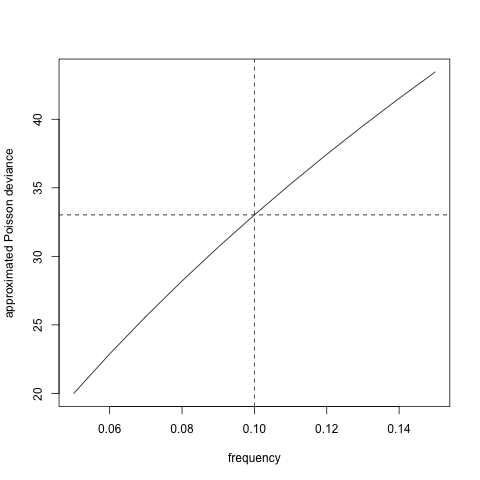

# 车险索赔频率预测 {#ch2}

## 背景介绍

车险数据量大，风险特征多，对车险数据分析时可以体现出机器学习算法的优势，即使用算法从大数据中挖掘有用信息、提取特征。

在精算中，常常使用车险保单数据和历史索赔数据进行风险分析、车险定价等。保单数据库是在承保的时候建立的，索赔数据库是在索赔发生时建立的，大部分保单没有发生索赔，所以它们不会在索赔数据库中体现。

保单数据库记录了车险的风险信息，包括：

1. 驾驶员特征：年龄、性别、工作、婚姻、地址等

2. 车辆特征：品牌、车座数、车龄、价格、马力等

3. 保单信息：保单编号、承保日期、到期日期

4. 奖惩系数

索赔数据库记录了保单的索赔信息，可以得到索赔次数$N$和每次的索赔金额$Y_l,l=1,\ldots,N$。理论上，车险的纯保费为以下随机和的期望

$$S=\sum_{l=1}^N Y_l$$
假设索赔次数$N$和索赔金额$Y_l$独立且$Y_l$服从独立同分布，则
$$\mathbf{E}(S)=\mathbf{E}(N)\times\mathbf{E}(Y)$$

所以，车险定价问题很多时候都转化为两个独立模型：索赔次数（频率）模型和索赔金额（强度）模型。对于索赔次数模型，通常假设因变量服从泊松分布，建立泊松回归模型，使用的数据量等于保单数；对于索赔金额模型，通常假设因变量服从伽马分布，建立伽马回归模型，使用的数据量等于发生索赔的保单数。通常，在数据量不大时，索赔金额模型的建立难于索赔次数模型，因为只有发生索赔的保单才能用于索赔金额模型的建立。

记第$i$个保单的风险信息为$x_i\in\mathcal{X}$，保险公司定价的目标就是找到两个（最优）回归方程（映射），使之尽可能准确地预测索赔频率和索赔强度:

$$\lambda: \mathcal{X}\rightarrow \mathbf{R}_+, ~~~ x \mapsto \lambda(x_i)$$
$$\mu: \mathcal{X}\rightarrow \mathbf{R}_+, ~~~ x \mapsto \mu(x_i)$$

这里，$\lambda(x_i)$是对$N$的期望的估计，$\mu(x_i)$是对$Y$的期望的估计。基于这两个模型，纯保费估计为$\lambda(x_i)\mu(x_i)$。

## 预测模型概述

如何得到一个好的预测模型呢？可以从两个方面考虑：

1. 让风险信息空间$\mathcal{X}$丰富，也称为特征工程，比如包含$x,x^2,\ln x$、或者加入车联网信息。

2. 让映射空间$\lambda\in{\Lambda},\mu\in M$丰富，如GLM只包含线性效应、相加效应，映射空间较小，神经网络包含非线性效应、交互作用，映射空间较大。

当你选取了映射空间较小的GLM，通常需要进行仔细的特征工程，使得风险信息空间适于GLM；当你选取了映射空间较大的神经网络，通常不需要进行特别仔细的特征工程，神经网络可以自动进行特征工程，发掘风险信息中的有用特征。

- 对于传统的统计回归模型，GLM，GAM，MARS，我们使用极大似然方法在映射空间中找到最优的回归方程，在极大似然中使用的数据集称为学习集（learning data set）。为了防止过拟合，我们需要进行协变量选择，可以删掉不显著的协变量，也可以使用逐步回归、最优子集、LASSO等，判断标准为AIC等。

- 对于树模型，我们使用 recursive partitioning by binary splits 算法对风险空间进行划分，使得各子空间内的应变量差异最小，差异通常使用偏差损失（deviance loss）度量。为了防止过拟合，通常使用交叉验证对树的深度进行控制。树模型训练使用的数据为学习集。

- 树模型的扩展为bootstrap aggregation（bagging）和random forest。第一种算法是对每个bootstrap样本建立树模型，然后平均每个树模型的预测；第二种算法类似第一种，但在建立树模型时，要求只在某些随机选定的协变量上分支。这两种扩展都属于集成学习（ensemble learning）。

- 提升算法有多种不同形式，它的核心思想类似逐步回归，区别是每步回归中需要依据上步的预测结果调整各个样本的权重，让上步预测结果差的样本在下步回归中占的权重较大。通常，每步回归使用的模型比较简单，如深度为3的树模型。提升算法也属于集成学习，和前面不同是它的弱学习器不是独立的，而bagging和rf的弱学习器是彼此独立的。

- 对于集成算法，通常需要调整弱学习器的结构参数，如树的深度，也要判断弱学习器的个数，这些称为tuning parameters，通常通过比较在验证集（validation）的损失进行调参，防止过拟合。弱学习器中的参数通过在训练集（training）上训练模型得到。训练集和验证集的并集为学习集。

- 前馈神经网络的输入神经元为风险信息，下一层神经元为上一层神经元的线性组合并通过激活函数的非线性变换，最后输出神经元为神经网络对因变量期望的预测，通过减小输出神经元与因变量观察值的差异，训练神经网络中的参数。神经网络含有非常多的参数，很难找到全局最优解，而且最优解必然造成过拟合，所以一般采用梯度下降法对参数进行迭代，使得训练集损失在每次迭代中都有下降趋势。通过比较验证集损失确定迭代次数和神经网络的结构参数，防止过拟合。


如何评价一个预测模型的好坏呢？通常用样本外损失（test error）评价。对于索赔频率，使用泊松偏差损失，对于索赔强度，使用伽马偏差损失，可以证明这两个损失函数和似然函数成负相关。其中，平均泊松偏差损失为：

$$\mathcal{L}(\mathbf{N},\mathbf{\hat{N}})=\frac{2}{|\mathbf{N}|}\sum_{i}N_i\left[\frac{\hat{N}_i}{N_i}-1-\ln\left(\frac{\hat{N}_i}{N_i}\right)\right]$$

Keras中定义的损失函数为

$$\tilde{\mathcal{L}}(\mathbf{N},\mathbf{\hat{N}})=\frac{1}{|\mathbf{N}|}\sum_{i}\left[\hat{N}_i-N_i\ln\left(\hat{N}_i\right)\right]$$

## 特征工程

加载包。

```{r, eval =F} 
rm(list=ls())
library(CASdatasets)
library(keras)
library(data.table)
library(glmnet)
library(plyr)
library(mgcv)
library(rpart)
#library(rpart.plot)
library(Hmisc)
#library(randomForest)
library(distRforest) # devtools::install_github('henckr/distRforest')
library(gbm)
data(freMTPL2freq)
#data(freMTPL2sev)
textwidth<-7.3 #inch
#fwrite(freMTPL2freq,"data/freMTPL2freq.txt")
#freMTPL2freq<-fread("data/freMTPL2freq_mac.txt")
```

### 截断

- 减少outliers/influential points 的影响

- 需根据每个变量的分布确定在哪里截断

  - 索赔次数在4截断

  - 风险暴露在1截断

  - 马力在9截断

  - 车龄在20截断

  - 年龄在90截断

  - 奖惩系数在150截断

### 离散化

- 目的是为了刻画非线性效应

- 需画出协变量的边缘经验索赔频率判断

- 离散化马力、车龄、年龄 `VehPowerFac, VehAgeFac，DrivAgeFac`   

### 设定基础水平

- 方便假设检验

- 设定含有最多风险暴露的水平为基准水平

### 协变量变形

- 目的是为了刻画非线性效应

- 考虑协变量分布，使之变形后近似服从对称分布

- `DriveAgeLn/2/3/4, DensityLn`

```{r, eval=FALSE}
dat <- freMTPL2freq
dat1 <- dat

# claim number

dat1$ClaimNb <- pmin(dat1$ClaimNb, 4)   

# exposure

dat1$Exposure <- pmin(dat1$Exposure, 1) 

# vehicle power

dat1$VehPowerFac <- as.factor(pmin(dat1$VehPower,9))
aggregate(dat1$Exposure,by=list(dat1$VehPowerFac),sum)
dat1[,"VehPowerFac"] <-relevel(dat1[,"VehPowerFac"], ref="6")

# vehicle age

dat1$VehAge <- pmin(dat1$VehAge,20)
VehAgeFac <- cbind(c(0:110), c(1, rep(2,5), rep(3,5),rep(4,5), 
                               rep(5,5), rep(6,111-21)))
dat1$VehAgeFac <- as.factor(VehAgeFac[dat1$VehAge+1,2])
aggregate(dat1$Exposure,by=list(dat1$VehAgeFac),sum)
dat1[,"VehAgeFac"] <-relevel(dat1[,"VehAgeFac"], ref="2")

# driver age

dat1$DrivAge <- pmin(dat1$DrivAge,90)
DrivAgeFac <- cbind(c(18:100), c(rep(1,21-18), rep(2,26-21), rep(3,31-26), 
                                 rep(4,41-31), rep(5,51-41), rep(6,71-51), rep(7,101-71)))
dat1$DrivAgeFac <- as.factor(DrivAgeFac[dat1$DrivAge-17,2])
aggregate(dat1$Exposure,by=list(dat1$DrivAgeFac),sum)
dat1[,"DrivAgeFac"] <-relevel(dat1[,"DrivAgeFac"], ref="6")
dat1$DrivAgeLn<-log(dat1$DrivAge)
dat1$DrivAge2<-dat1$DrivAge^2
dat1$DrivAge3<-dat1$DrivAge^3
dat1$DrivAge4<-dat1$DrivAge^4

# bms

dat1$BonusMalus <- as.integer(pmin(dat1$BonusMalus, 150))

# vehicle brand

dat1$VehBrand <- factor(dat1$VehBrand)      # consider VehGas as categorical
aggregate(dat1$Exposure,by=list(dat1$VehBrand),sum)
dat1[,"VehBrand"] <-relevel(dat1[,"VehBrand"], ref="B1")

# vehicle gas

dat1$VehGas <- factor(dat1$VehGas)      # consider VehGas as categorical
aggregate(dat1$Exposure,by=list(dat1$VehGas),sum)
dat1[,"VehGas"] <-relevel(dat1[,"VehGas"], ref="Regular")

# area (related to density)

dat1$Area <- as.integer(dat1$Area)

# density

dat1$DensityLn <- as.numeric(log(dat1$Density))

# region

aggregate(dat1$Exposure,by=list(dat1$Region),sum)[order(aggregate(dat1$Exposure,by=list(dat1$Region),sum)$x),]
dat1[,"Region"] <-relevel(dat1[,"Region"], ref="Centre")
str(dat1)

# model matrix for GLM

design_matrix<-model.matrix( ~ ClaimNb + Exposure + VehPowerFac + VehAgeFac + 
                               DrivAge + DrivAgeLn + DrivAge2 + DrivAge3 + DrivAge4 + 
                               BonusMalus + VehBrand + VehGas + Area + DensityLn + Region, data=dat1)[,-1] 
# VehPower, VehAge as factor variables
# design_matrix2<-model.matrix( ~ ClaimNb + Exposure + VehPower + VehAge + DrivAge + 
#                                 BonusMalus + VehBrand + VehGas + Area + DensityLn + Region, data=dat1)[,-1] 
# VehPower, VehAge, and DrivAge as continuous variables
# dim(design_matrix2)
```

## 训练集-验证集-测试集

- 比例为$0.6:0.2:0.2$

- 根据索赔次数分层抽样

- 经验索赔频率约为$10%$

```{r,eval=F}
seed_split<-11

# claim 0/1 proportions

index_zero<-which(dat1$ClaimNb==0)
index_one<-which(dat1$ClaimNb>0)
prop_zero<-round(length(index_zero)/(length(index_one)+length(index_zero)),2);prop_zero
prop_one<-round(length(index_one)/(length(index_one)+length(index_zero)),2);prop_one

# 0.6:0.2:0.2

size_valid<-round(nrow(dat1)*0.2,0)
size_test<-size_valid
size_train<-nrow(dat1)-2*size_valid

# stratified sampling

set.seed(seed_split)
index_train_0<-sample(index_zero,size_train*prop_zero)
index_train_1<-sample(index_one, size_train-length(index_train_0))
index_train<-union(index_train_0,index_train_1)
length(index_train);size_train
index_valid<-c(sample(setdiff(index_zero,index_train_0),round(size_valid*prop_zero,0)),
               sample(setdiff(index_one,index_train_1),size_valid-round(size_valid*prop_zero,0)))
length(index_valid);size_valid
index_test<-setdiff(union(index_zero,index_one),union(index_train,index_valid))
index_learn<-union(index_train,index_valid)
length(index_train);length(index_valid);length(index_test)

# train-validation-test; learn-test的

dat1_train<-dat1[index_train,]
dat1_valid<-dat1[index_valid,]
dat1_test<-dat1[index_test,]
dat1_learn<-dat1[index_learn,]
sum(dat1_train$ClaimNb)/sum(dat1_train$Exposure)
sum(dat1_valid$ClaimNb)/sum(dat1_valid$Exposure)
sum(dat1_test$ClaimNb)/sum(dat1_test$Exposure)
sum(dat1_learn$ClaimNb)/sum(dat1_learn$Exposure)

# glm matrix

matrix_train<-design_matrix[index_train,]
matrix_valid<-design_matrix[index_valid,]
matrix_test<-design_matrix[index_test,]
matrix_learn<-design_matrix[index_learn,]

# gbm matrix (learn)

dat1_learn_gbm<-data.frame(ClaimNb=dat1_learn$ClaimNb, Exposure=dat1_learn$Exposure,
                           VehPower=dat1_learn$VehPower, VehAge=dat1_learn$VehAge,
                           DrivAge=dat1_learn$DrivAge, BonusMalus=dat1_learn$BonusMalus,
                           VehBrand=dat1_learn$VehBrand, VehGas=dat1_learn$VehGas,
                           Area=dat1_learn$Area, DensityLn=dat1_learn$DensityLn,
                           Region=dat1_learn$Region)
train_pro<-size_train/(size_train+size_valid)
```

##  泊松偏差损失函数

- 平均泊松偏差损失

$$\mathcal{L}(\mathbf{N},\mathbf{\hat{N}})=\frac{2}{|\mathbf{N}|}\sum_{i}N_i\left[\frac{\hat{N}_i}{N_i}-1-\ln\left(\frac{\hat{N}_i}{N_i}\right)\right]$$

- Keras定义平均泊松偏差损失为

$$\tilde{\mathcal{L}}(\mathbf{N},\mathbf{\hat{N}})=\frac{1}{|\mathbf{N}|}\sum_{i}\left[\hat{N}_i-N_i\ln\left(\hat{N}_i\right)\right]$$
  
- 因为对于大部分保单，$N_i-N_i\ln N_i\approx0$，所以泊松偏差损失函数约为Keras定义的2倍（至少在一个量级）。

$$\mathcal{L}(\mathbf{N},\mathbf{\hat{N}})\approx2\tilde{\mathcal{L}}(\mathbf{N},\mathbf{\hat{N}})$$

```{r, eval=F}
Poisson.Deviance <- function(pred,obs)
  {200*(sum(pred)-sum(obs)+sum(log((obs/pred)^(obs))))/length(pred)}
keras_poisson_dev<-function(y_hat,y_true)
  {100*sum(y_hat-y_true*log(y_hat))/length(y_true)}
f_keras<-function(x) 100*(x-x*log(x))
f_keras(0.1);f_keras(0.2)
png("./plots/poi_dev.png")
plot(seq(0.05,0.15,0.01),f_keras(seq(0.05,0.15,0.01)),type="l",
     xlab="frequency",ylab="approximated Poisson deviance")
abline(v=0.1,lty=2);abline(h=f_keras((0.1)),lty=2)
dev.off()
```

```{r,eval=T,out.width="50%",fig.align = 'center'}
knitr::opts_chunk$set(fig.pos = "!H", out.extra = "")

```

##  GLM & GAM

- 使用极大似然方法在映射空间中找到最优的回归方程

- 在极大似然中使用的数据集称为学习集（learning data set）。

- 为了防止过拟合，我们需要进行协变量选择，可以删掉不显著的协变量，也可以使用逐步回归、最优子集、LASSO等，判断标准为AIC等。

### GLM

- 同质模型 $$\mathbf{E}(N)=\beta_0$$

- 全模型 


    $$\ln \mathbf{E}(N)=\ln e + \beta_0 + \beta_{\text{VehPowerFac}} + \beta_{\text{VehAgeFac}} \\ + \beta_1\text{DrivAge} + \beta_2\ln\text{DrivAge} + \beta_3\text{DrivAge}^2 + \beta_4\text{DrivAge}^3 + \beta_5\text{DrivAge}^4 \\ \beta_6\text{BM} + \beta_{\text{VehBrand}} + \beta_{\text{VehGas}} + \beta_7\text{Area} + \beta_8\text{DensityLn} + \beta_{\text{Region}}$$
```{r, eval=F}

# homogeneous model

d.glm0 <- glm(ClaimNb ~ 1 + offset(log (Exposure)), data=data.frame(matrix_learn), family=poisson())
#summary(d.glm0)
dat1_test$fitGLM0 <- predict(d.glm0, newdata=data.frame(matrix_test), type="response")
keras_poisson_dev(dat1_test$fitGLM0,matrix_test[,1])
Poisson.Deviance(dat1_test$fitGLM0,matrix_test[,1])

# full GLM

names(data.frame(matrix_learn))
{t1 <- proc.time()
d.glm1 <- glm(ClaimNb ~ .-Exposure + offset(log(Exposure)), data=data.frame(matrix_learn), family=poisson())
(proc.time()-t1)}
# summary(d.glm1)
dat1_train$fitGLM1 <- predict(d.glm1, newdata=data.frame(matrix_train), type="response")
dat1_valid$fitGLM1 <- predict(d.glm1, newdata=data.frame(matrix_valid), type="response")
dat1_test$fitGLM1 <- predict(d.glm1, newdata=data.frame(matrix_test), type="response")
dat1_learn$fitGLM1 <- predict(d.glm1, newdata=data.frame(matrix_learn), type="response")
keras_poisson_dev(dat1_test$fitGLM1,matrix_test[,1])
Poisson.Deviance(dat1_test$fitGLM1,matrix_test[,1])
```

### GAM

- GAM边缘提升模型

$$\ln \mathbf{E}(N)=\ln\hat{\lambda}_{\text{GLM}}+s_1(\text{VehAge})+s_2(\text{BM})$$

- $s_1,s_2$为样条平滑函数。

- 使用`ddply`聚合数据，找到充分统计量，加快模型拟合速度。

```{r, eval=F}

#  GAM marginals improvement (VehAge and BonusMalus)

{t1 <- proc.time()
dat.GAM <- ddply(dat1_learn, .(VehAge, BonusMalus), summarise, 
                 fitGLM1=sum(fitGLM1), ClaimNb=sum(ClaimNb))
set.seed(1)
d.gam <- gam(ClaimNb ~ s(VehAge, bs="cr")+s(BonusMalus, bs="cr") + 
               offset(log(fitGLM1)), data=dat.GAM, method="GCV.Cp", family=poisson)
(proc.time()-t1)}
summary(d.gam)
dat1_train$fitGAM1 <- predict(d.gam, newdata=dat1_train,type="response")
dat1_valid$fitGAM1 <- predict(d.gam, newdata=dat1_valid,type="response")
dat1_test$fitGAM1 <- predict(d.gam, newdata=dat1_test,type="response")
keras_poisson_dev(dat1_test$fitGAM1, dat1_test$ClaimNb)
Poisson.Deviance(dat1_test$fitGAM1,matrix_test[,1])
```

### Step wise、LASSO协变量选择

- 逐步回归非常慢，在Linux 8核i7 3.4GHz 16G内存都需要50多分钟。且样本外损失和全模型没有明显减小。

- 5折CV Lasso在Linux 8核i7 3.4GHz 16G内存需要5分钟。

- 根据5折CV-error选取正则参数`beta=4*10^-5`，但样本外损失和全模型没有明显减小。

```{r,eval=F}

# step wise selection； this takes a long time (more than 50 minutes!)

d.glm00 <- glm(ClaimNb ~ VehAgeFac1 + VehAgeFac3 + VehAgeFac4 + VehAgeFac5 + 
                 DrivAge + DrivAge2 + DrivAge3 + DrivAge4 + DrivAgeLn + 
                 BonusMalus + VehBrandB12 + VehGasDiesel + DensityLn + 
                 offset(log (Exposure)), 
               data=data.frame(matrix_learn), family=poisson())
# {t1 <- proc.time()
# d.glm2<-step(d.glm00,direction="forward",trace = 1,
#              scope =list(lower=formula(d.glm00), upper=formula(d.glm1)))
# (proc.time()-t1)}
d.glm2<-glm(ClaimNb ~ VehAgeFac1 + VehAgeFac3 + VehAgeFac4 + VehAgeFac5 + 
    DrivAge + DrivAge2 + DrivAge3 + DrivAge4 + DrivAgeLn + BonusMalus + 
    VehBrandB12 + VehGasDiesel + DensityLn + VehPowerFac4 + VehPowerFac8 + 
    RegionNord.Pas.de.Calais + VehPowerFac7 + RegionRhone.Alpes + 
    RegionBretagne + RegionAuvergne + RegionLimousin + RegionLanguedoc.Roussillon + 
    RegionIle.de.France + RegionAquitaine + RegionMidi.Pyrenees + 
    RegionPays.de.la.Loire + RegionProvence.Alpes.Cotes.D.Azur + 
    RegionPoitou.Charentes + RegionHaute.Normandie + VehBrandB5 + 
    VehBrandB11 + RegionBasse.Normandie + VehBrandB14 + RegionCorse + 
    offset(log(Exposure)), data=data.frame(matrix_learn), family=poisson())
summary(d.glm2)
dat1_test$fitGLM2 <- predict(d.glm2, newdata=data.frame(matrix_test), type="response")
keras_poisson_dev(dat1_test$fitGLM2,data.frame(matrix_test)$ClaimNb)
Poisson.Deviance(dat1_test$fitGLM2,matrix_test[,1])

# lasso regression； this takes a few minutes

alpha0=1 # 1 for lasso, 0 for ridge.
set.seed(7)
# {t1 <- proc.time()
# cvfit = cv.glmnet(matrix_learn[,-c(1,2)], matrix_learn[,1], 
#                   family = "poisson",offset=log(matrix_learn[,2]),
#                   alpha = alpha0,nfolds = 5,trace.it = 1)
# (proc.time()-t1)}
# cvfit$lambda.min #4*10^-5
# cvfit$lambda.1se # 0.0016
plot(cvfit)
d.glm3 = glmnet(matrix_learn[,-c(1,2)], matrix_learn[,1], 
                family = "poisson", offset=log(matrix_learn[,2]), 
                alpha=alpha0, lambda=4.024746e-05, trace.it = 1)

dat1_test$fitLasso<-predict(d.glm3, newx = matrix_test[,-c(1,2)],
                            newoffset=log(matrix_test[,2]),type = "response")
keras_poisson_dev(dat1_test$fitLasso, matrix_test[,1])
Poisson.Deviance(dat1_test$fitLasso, matrix_test[,1])
```

## Possion tree

- 对于树模型，我们使用 recursive partitioning by binary splits 算法对风险空间进行划分，使得各子空间内的应变量差异最小

- 为了防止过拟合，使用交叉验证确定cost-complexity parameter `cp`，进而对树的深度进行控制。

```{r,eval=F}

# cross validation using xval in rpart.control

names(dat1_learn)
set.seed(1)
{t1 <- proc.time()
tree0<-rpart(cbind(Exposure, ClaimNb) ~ VehPower + VehAge + DrivAge + BonusMalus + VehBrand + VehGas + Area + DensityLn + Region, data = dat1_learn, method = "poisson", control = rpart.control (xval=5, minbucket=1000 ,cp=10^-5,maxcompete = 0,maxsurrogate = 0))
(proc.time()-t1)}
# printcp(tree0)
x0 <- log10(tree0$cptable[,1])
err0<-tree0$cptable[,4]
std0<-tree0$cptable[,5]
xmain <- "cross-validation error plot"
xlabel <- "cost-complexity parameter (log-scale)"
ylabel <- "relative CV error"

png("./plots/tree_cv.png")
errbar(x=x0, y=err0*100, yplus=(err0+std0)*100, yminus=(err0-std0)*100, xlim=rev(range(x0)), col="blue", main=xmain, ylab=ylabel, xlab=xlabel)
lines(x=x0, y=err0*100, col="blue")
abline(h=c(min(err0+std0)*100), lty=1, col="orange")
abline(h=c(min(err0)*100), lty=1, col="magenta")
abline(v=-3.32,lty=2)
legend(x="topright", col=c("blue", "orange", "magenta","black"), lty=c(1,1,1,2), lwd=c(1,1,1,1), pch=c(19,-1,-1,-1), legend=c("tree0", "1-SD rule", "min.CV rule","log cp = -3.32"))
dev.off()
tree1 <- prune(tree0, cp=10^-3.32) # cp=10^-3.32
tree11<- prune(tree0, cp=tree0$cptable[which.min(err0),1]) # cp=10^-4
printcp(tree1)
printcp(tree11)
#tree1
dat1_test$fitRT_1se <- predict(tree1, newdata=dat1_test)*dat1_test$Exposure
dat1_test$fitRT_min <- predict(tree11, newdata=dat1_test)*dat1_test$Exposure
keras_poisson_dev(dat1_test$fitRT_1se, dat1_test$ClaimNb)
keras_poisson_dev(dat1_test$fitRT_min, dat1_test$ClaimNb)
Poisson.Deviance(dat1_test$fitRT_1se, dat1_test$ClaimNb)
Poisson.Deviance(dat1_test$fitRT_min, dat1_test$ClaimNb)

tree1$variable.importance
tree11$variable.importance

# K-fold cross-validation using xpred.rpart

# tree0$cptable
set.seed(1)
{t1 <- proc.time()
tree00<-rpart(cbind(Exposure, ClaimNb) ~ VehPower + VehAge + DrivAge + 
                BonusMalus + VehBrand + VehGas + Area + DensityLn + Region, 
              data = dat1_learn, method = "poisson", 
              control = rpart.control (xval=1, minbucket=1000 ,cp=10^-5,
                                       maxcompete = 0,maxsurrogate = 0))
(proc.time()-t1)}
(n_subtrees <- dim(tree00$cptable)[1])
std1<- numeric(n_subtrees)
err1 <- numeric(n_subtrees)
K <- 10                  
xgroup <- rep(1:K, length = nrow(dat1_learn))
xfit <- xpred.rpart(tree00, xgroup)
dim(xfit)
for (i in 1:n_subtrees){
 err_group<-rep(NA,K)
 for (k in 1:K){
  ind_group <- which(xgroup ==k)  
  err_group[k] <- keras_poisson_dev(dat1_learn[ind_group,"Exposure"]*xfit[ind_group,i],dat1_learn[ind_group,"ClaimNb"])
  }
  err1[i] <- mean(err_group)             
  std1[i] <- sd(err_group)
}
x1 <- log10(tree00$cptable[,1])
xmain <- "cross-validation error plot"
xlabel <- "cost-complexity parameter (log-scale)"
ylabel <- "CV error (in 10^(-2))"
errbar(x=x1, y=err1*100, yplus=(err1+std1)*100, yminus=(err1-std1)*100, xlim=rev(range(x1)), col="blue", main=xmain, ylab=ylabel, xlab=xlabel)
lines(x=x1, y=err1*100, col="blue")
abline(h=c(min(err1+std1)*100), lty=1, col="orange")
abline(h=c(min(err1)*100), lty=1, col="magenta")
abline(v=-3.12,lty=2)
legend(x="topright", col=c("blue", "orange", "magenta","black"), lty=c(1,1,1,2), lwd=c(1,1,1,1), pch=c(19,-1,-1,-1), legend=c("tree1", "1-SD rule", "min.CV rule","log cp = -3.12"))
tree2 <- prune(tree00, cp=10^-3.12)
tree22 <- prune(tree00, cp=tree00$cptable[which.min(err1),1])
printcp(tree2)
printcp(tree22)
dat1_test$fitRT2 <- predict(tree2, newdata=dat1_test)*dat1_test$Exposure
dat1_test$fitRT22 <- predict(tree22, newdata=dat1_test)*dat1_test$Exposure
keras_poisson_dev(dat1_test$fitRT2, dat1_test$ClaimNb)
keras_poisson_dev(dat1_test$fitRT22, dat1_test$ClaimNb)
Poisson.Deviance(dat1_test$fitRT2, dat1_test$ClaimNb)
Poisson.Deviance(dat1_test$fitRT22, dat1_test$ClaimNb)
sum((dat1_test$fitRT22-dat1_test$fitRT11)^2)
tree2$variable.importance
tree22$variable.importance
```

## Random forest
```{r,eval=F}

ntrees0<-200
set.seed(1)
{t1 <- proc.time()
forest1<-rforest(cbind(Exposure, ClaimNb) ~ Area + VehPower + VehAge + DrivAge + BonusMalus + VehBrand + VehGas + DensityLn + Region, data = dat1_train, method = "poisson", control = rpart.control (xval=0, minbucket=1000 ,cp=10^-5,maxcompete = 0,maxsurrogate = 0),parms=list(shrink=0), ncand=5,ntrees = ntrees0, subsample = 0.5, red_mem = T)
(proc.time()-t1)}

fit_valid<-rep(0,nrow(dat1_valid))
error_valid<-rep(0,ntrees0)
for (i in 1:ntrees0){
  fit_valid<-fit_valid+predict(forest1[[i]], newdata=dat1_valid)*dat1_valid$Exposure
  fit_valid_norm <- fit_valid/i
  error_valid[i]<-Poisson.Deviance(fit_valid_norm, dat1_valid$ClaimNb)
}
pdf("plots/random_forest_error.pdf",height =textwidth,width=textwidth,pointsize =11)
plot(error_valid,type="l",xlab="number of trees",ylab="validation error in 10^-2")
dev.off()

best.trees=100
fitRF<-rep(0,nrow(dat1_test))
for (i in 1:best.trees){
  fitRF<-fitRF+predict(forest1[[i]], newdata=dat1_test)*dat1_test$Exposure
}
dat1_test$fitRF <- fitRF/best.trees
keras_poisson_dev(dat1_test$fitRF, dat1_test$ClaimNb)
names(forest1[[2]]$variable.importance)
sum(forest1[[3]]$variable.importance)
```

## Boosting Poisson tree
```{r eval=F}
set.seed(1)
{t1 <- proc.time()
  gbm1 <-
    gbm(
      ClaimNb ~ Area + VehPower + VehAge + DrivAge + BonusMalus + VehBrand + VehGas + DensityLn + Region + offset(log(Exposure)),
      data = dat1_learn_gbm,
      distribution = "poisson",
      n.trees = 200,
      shrinkage = 0.3,
      interaction.depth = 5,
      bag.fraction = 0.5,
      train.fraction = train_pro,
      cv.folds = 0,
      n.minobsinnode = 1000,
      verbose = T
    )
(proc.time()-t1)}
# plot the performance
pdf("plots/gbm_error.pdf",height =textwidth,width=textwidth,pointsize =11)
gbm.perf(gbm1,method="test")
legend("topright",lty=c(1,1,2),col=c("black","red","blue"),c("training error", "validation error", "best iterations"))
dev.off()
best.iter<-gbm.perf(gbm1,method="test")
dat1_test$fitGBM1<-predict(gbm1, dat1_test,n.trees=best.iter,type="response")*dat1_test$Exposure
keras_poisson_dev(dat1_test$fitGBM1,dat1_test$ClaimNb)
# plot variable influence ?
summary(gbm1)
# create marginal plots
# plot variable X1,X2,X3 after "best" iterations
par(mfrow=c(2,2))
plot(gbm1,5,best.iter)
plot(gbm1,3,best.iter)
plot(gbm1,6,best.iter)
plot(gbm1,4,best.iter)

par(mfrow=c(2,2))
plot(gbm1,c(5,3),best.iter) 
plot(gbm1,c(5,6),best.iter)
plot(gbm1,c(5,4),best.iter) 
plot(gbm1,c(3,4),best.iter,col=terrain.colors(20)) 
```

## Neural network

## Summary
```{r,eval=F}
dev_sum <- data.frame(model=c("Intercept","GLM","GLM Lasso","GAM","Decision tree", "Random forest","Generalized boosted model"), test_error=rep(NA,7),test_error_keras=rep(NA,7))
dev_sum$test_error[1]<-Poisson.Deviance(dat1_test$fitGLM0,matrix_test[,1])
dev_sum$test_error_keras[1]<-keras_poisson_dev(dat1_test$fitGLM0,matrix_test[,1])
dev_sum$test_error[2]<-Poisson.Deviance(dat1_test$fitGLM1,matrix_test[,1])
dev_sum$test_error_keras[2]<-keras_poisson_dev(dat1_test$fitGLM1,matrix_test[,1])
dev_sum$test_error[3]<-Poisson.Deviance(dat1_test$fitLasso,matrix_test[,1])
dev_sum$test_error_keras[3]<-keras_poisson_dev(dat1_test$fitLasso,matrix_test[,1])
dev_sum$test_error[4]<-Poisson.Deviance(dat1_test$fitGAM1, dat1_test$ClaimNb)
dev_sum$test_error_keras[4]<-keras_poisson_dev(dat1_test$fitGAM1, dat1_test$ClaimNb)
dev_sum$test_error[5]<-Poisson.Deviance(dat1_test$fitRT_min, dat1_test$ClaimNb)
dev_sum$test_error_keras[5]<-keras_poisson_dev(dat1_test$fitRT_min, dat1_test$ClaimNb)
dev_sum$test_error[6]<-Poisson.Deviance(dat1_test$fitRF, dat1_test$ClaimNb)
dev_sum$test_error_keras[6]<-keras_poisson_dev(dat1_test$fitRF, dat1_test$ClaimNb)
dev_sum$test_error[7]<-Poisson.Deviance(dat1_test$fitGBM1,dat1_test$ClaimNb)
dev_sum$test_error_keras[7]<-keras_poisson_dev(dat1_test$fitGBM1,dat1_test$ClaimNb)
dev_sum[,2:3]<-round(dev_sum[,2:3],4)
write.csv(dev_sum,"dev_sum.csv")
dev_sum
```


