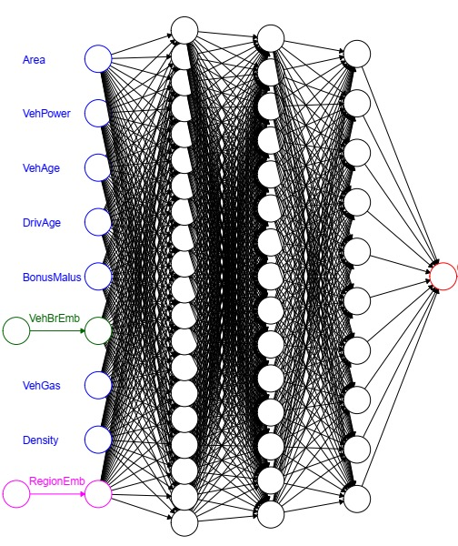
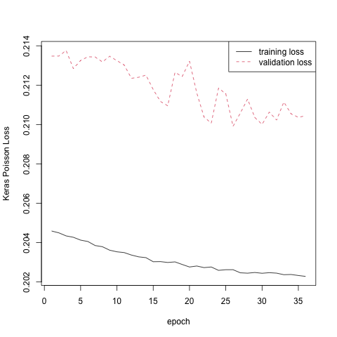

# 神经网络 {#nn} 

正如计算机速度的提升和MCMC方法给贝叶斯统计带来了生机，计算机运算能力的提升和反向传播算法（back propagation）也给神经网络带来了飞速发展。

`Tensorflow`和`Pytorch`的更新速度反映了这个领域的热度。

## 建立神经网络的一般步骤

### 明确目标和数据类型

- 神经网络是一种非参非线性回归模型，它可以刻画非线性效应和交互效应。
   
- 在使用神经网络前，需要理解研究目标和数据结构，有一些特殊的layer，如卷积层，专门为某种任务、或某种数据结构而设立，不是可以用在任何的数据上。
   
- 神经网络有大量的参数，全局最优解必然会造成过拟合，通常利用验证集损失来判断梯度下降的次数。

### 数据预处理

- 描述性统计分析

- 缺失值、异常值处理

- 连续型变量标准化，主要是为了让梯度下降法更有效地工作。常用的标准化方法有*MinMaxScaler*
   
   $$x^*=2\frac{x-\min x}{\max x - \min x}-1$$
   
- 分类变量，可以使用dummy coding、one-hot encoding，或者使用神经网络中的embedding layer。第三种办法可以有效地减少参数个数。
   
- 训练-验证-测试数据分割：训练集用于梯度下降法求解参数，验证集用于判断epoch次数、调整模型结构的超参数，测试集用于比较不同模型的样本外预测能力。

### 选取合适的神经网络类型

- 全连接神经网络：适用于一般的回归问题，如索赔频率预测。信息一直向前传递。参数个数较多。可解释性差。
   
- 卷积神经网络：适用于数据有空间结构，且相同的模式可能出现在不同的位置，如图像识别。信息一直向前传递。参数个数较少。有可解释性。
   
- 递归神经网络：适用于数据有时间序列特征，且相同的模式可能出现在不同时间点，如天气预报、语音识别。信息可以返回到前面的神经元。参数个数较多。可解释性差。

### 建立神经网络（全连接神经网络）

在建立神经网络时，需要考虑以下几点：

- 输入层数据类型
   
- 隐藏层层数，隐藏层性质，神经元个数，激活函数，正则化，dropout
   
- 输出神经元数据类型，输出神经元激活函数
   
- 损失函数选择
   
### 训练神经网络

在训练神经网络时，需要考虑以下几点

- 梯度下降法（optimizer）

- 迭代次数（patience）
   
- 遍历次数（epoch），批量大小（batch size）
   
### 调参

返回第4步，调整模型结构的超参数（hyper-parameter tuning），观察验证损失的变化，选取最终模型。

## 数据预处理
      
      'data.frame':	678013 obs. of  12 variables:
       $ IDpol     : num  1 3 5 10 11 13 15 17 18 21 ...
       $ ClaimNb   : 'table' num [1:678013(1d)] 1 1 1 1 1 1 1 1 1 1 ...
       $ Exposure  : num  0.1 0.77 0.75 0.09 0.84 0.52 0.45 0.27 0.71 0.15 ...
       $ VehPower  : int  5 5 6 7 7 6 6 7 7 7 ...
       $ VehAge    : int  0 0 2 0 0 2 2 0 0 0 ...
       $ DrivAge   : int  55 55 52 46 46 38 38 33 33 41 ...
       $ BonusMalus: int  50 50 50 50 50 50 50 68 68 50 ...
       $ VehBrand  : Factor w/ 11 levels "B1","B10","B11",..: 4 4 4 4 4 4 4 4 4 4 ...
       $ VehGas    : chr  "Regular" "Regular" "Diesel" "Diesel" ...
       $ Area      : Factor w/ 6 levels "A","B","C","D",..: 4 4 2 2 2 5 5 3 3 2 ...
       $ Density   : int  1217 1217 54 76 76 3003 3003 137 137 60 ...
       $ Region    : Factor w/ 21 levels "Alsace","Aquitaine",..: 21 21 18 2 2 16 16 13 13 17 ...

在进行下面code之前，需要运行上一章的代码直到Tree之前。

- 连续型变量：标准化处理。

```{r feature normalization, eval=F}
PreProcess.Continuous <- function(var1, dat1){
   names(dat1)[names(dat1) == var1]  <- "V1"
   dat1$X <- as.numeric(dat1$V1)
   dat1$X <- 2*(dat1$X-min(dat1$X))/(max(dat1$X)-min(dat1$X))-1
   names(dat1)[names(dat1) == "V1"]  <- var1
   names(dat1)[names(dat1) == "X"]  <- paste(var1,"X", sep="")
   dat1
   }

Features.PreProcess <- function(dat1){
   dat1$VehPower <- pmin(dat1$VehPower,9)
   dat1 <- PreProcess.Continuous("VehPower", dat1)   
   dat1$VehAge <- pmin(dat1$VehAge,20)
   dat1 <- PreProcess.Continuous("VehAge", dat1)   
   dat1$DrivAge <- pmin(dat1$DrivAge,90)
   dat1 <- PreProcess.Continuous("DrivAge", dat1)   
   dat1$BonusMalus <- pmin(dat1$BonusMalus,150)
   dat1 <- PreProcess.Continuous("BonusMalus", dat1)   
   dat1$VehBrandX <- as.integer(dat1$VehBrand)-1  # categorical variable
   dat1$VehGas <- as.factor(dat1$VehGas)
   dat1$VehGasX <- as.integer(dat1$VehGas) - 1.5 # binary: continuous or categorical
   dat1 <- PreProcess.Continuous("Area", dat1)   
   dat1 <- PreProcess.Continuous("Density", dat1)   
   dat1$RegionX <- as.integer(dat1$Region) - 1 # categorical
   dat1
}

dat2 <- Features.PreProcess(freMTPL2freq)   
names(dat2)
dat2_train<-dat2[index_train,]
dat2_valid<-dat2[index_valid,]
dat2_test<-dat2[index_test,]
dat2_learn<-dat2[index_learn,]
```

- 分类变量： 采用embedding layer。

- 训练集-验证集-测试集：分层抽样。

- 调整数据结构，使其匹配神经网络的输入层及其维度。输入数据集包括`Xtrain, Brtain, Retrain, Vtrain`，因变量数据集为`Ytrain`。

```{r data split, eval=F}
lambda.hom <- sum(dat2_train$ClaimNb)/sum(dat2_train$Exposure);lambda.hom
names(dat2)

# index of continous variables (non-categorical)

features <- c(13:16, 18:20)
names(dat2_learn)[features]
(q0 <- length(features))

# training data

Xtrain<- as.matrix(dat2_train[, features])  # design matrix learning sample
Brtrain <- as.matrix(dat2_train$VehBrandX)
Retrain <- as.matrix(dat2_train$RegionX)
Ytrain<- as.matrix(dat2_train$ClaimNb)
Vtrain<-as.matrix(log(dat2_train$Exposure*lambda.hom))

# validation data 

Xvalid<- as.matrix(dat2_valid[, features])  # design matrix learning sample
Brvalid <- as.matrix(dat2_valid$VehBrandX)
Revalid <- as.matrix(dat2_valid$RegionX)
Yvalid<- as.matrix(dat2_valid$ClaimNb)
Vvalid<-as.matrix(log(dat2_valid$Exposure*lambda.hom))
xxvalid<-list(Xvalid,Brvalid,Revalid,Vvalid)

# testing data

Xtest <- as.matrix(dat2_test[, features])    # design matrix test sample
Brtest <- as.matrix(dat2_test$VehBrandX)
Retest <- as.matrix(dat2_test$RegionX)
Ytest <- as.matrix(dat2_test$ClaimNb)
Vtest <- as.matrix(log(dat2_test$Exposure*lambda.hom))
```

## 神经网络提升模型 （combined actuarial neural network）

基本结构

$$\ln \lambda(\mathbf{x})= e\hat{\lambda}^{\text{GAM}}(\mathbf{x})\hat{\lambda}^{\text{NN}}(\mathbf{x})$$

其中，$\hat{\lambda}^{\text{GAM}}$为广义可加边缘提升模型的索赔频率估计值（参见上一章），$\hat{\lambda}^{\text{NN}}$为神经网络索赔频率的估计值，第一项在模型训练中保持不变。

使用上述模型的优点：

- $\hat{\lambda}^{\text{GAM}}$的部分可解释性。

- 神经网络从一个相对“较好”的初始状态$e\hat{\lambda}^{\text{GAM}}(\mathbf{x})$开始训练，很快收敛。

在代码实现中，可以把$e\hat{\lambda}^{\text{GAM}}$当作伪风险暴露数。

```{r vol, eval=F}
CANN <- 1  # 0 = normal NN, 1=CANN
if (CANN==1){
     Vtrain <- as.matrix(log(dat1_train$fitGAM1))
     Vvalid<- as.matrix(log(dat1_valid$fitGAM1))
     Vtest <- as.matrix(log(dat1_test$fitGAM1))
}
```

## 神经网络结构

```{r nn-structure,echo=F,out.width="60%",fig.align = 'center'}
knitr::opts_chunk$set(fig.pos = "!H", out.extra = "")

```

在构建神经网络时，需要注意以下几点：

### 结构参数

1. 神经网络结构的超参数选择，`BrLabel`为车型个数，`ReLabel`为地区个数，`q1-q4`为四个隐藏层中神经元个数，`d`为embedding layer中神经元个数。

```{r hyperparameter,eval=F}
# hyperparameters of the neural network architecture

(BrLabel <- length(unique(dat2_train$VehBrandX)))
(ReLabel <- length(unique(dat2_train$RegionX)))
q1 <- 20   
q2 <- 15
q3 <- 10
q4 <- 5
d <- 1        # dimensions embedding layers for categorical features
```

### 输入层

2. 输入层包括`Design, VehBrand, Region, LogVol`，其中`Design`为连续型协变量的输入层，`VehBrand, Region`为分类变量的输入层，`LogVol`直接连接到模型输出神经元。

3. `shape`表示输入（输出）维度（神经元个数）,`dtype`表示数据类型，`name`表示层名。

4.  `shape=(None, 7)` 中`None`表示样本大小，因为还没有数据进入神经网络，故此时不确定。

      Tensor("Design_1:0", shape=(None, 7), dtype=float32)

```{r input layer, eval=F}
# input layer

(Design   <- layer_input(shape = c(q0),  dtype = 'float32', name = 'Design'))
(VehBrand <- layer_input(shape = c(1),   dtype = 'int32', name = 'VehBrand'))
(Region   <- layer_input(shape = c(1),   dtype = 'int32', name = 'Region'))
(LogVol   <- layer_input(shape = c(1),   dtype = 'float32', name = 'LogVol'))
```

### Embedding layer

5. 建立一个layer，需要明确输入神经元个数`input_dim`和输出神经元个数`output_dim`，通常需要指定输出神经元个数，而输入神经元个数由它的上层输出神经元个数决定。

6. 把分类变量用`layer_embedding`处理，这两个`layer_embedding`的输出神经元个数为$d$，即每个水平通过`layer_embedding`输出$d$个连续型变量，当$d=1$，`layer_embedding`类似于GLM对分类变量的处理。`input_length`主要用于时间序列数据，如每个样本为多个词组成的一句话，这里一个样本只有一个水平，故`input_length = 1`。

7. `layer_flatten`用于调整维度，`layer_flatten`的输入维度是$n\times 1\times d$，输出维度是$n\times d$，该层没有参数。该输出维度是`layer_dense`要求的输入维度。建立神经网络需要注意层间维度匹配。

8. `BrandEmb`建立的映射为$\{1,\ldots,11\}\rightarrow 1\times\mathbf{R}^d\rightarrow\mathbf{R}^d$. `RegionEmb`建立的映射为$\{1,\ldots,21\}\rightarrow 1\times\mathbf{R}^d\rightarrow\mathbf{R}^d$

```{r embedding layer, eval=F}
# embedding layer

(BrandEmb = VehBrand %>% 
    layer_embedding(input_dim = BrLabel, output_dim = d, 
                    input_length = 1, name = 'BrandEmb') %>%
   layer_flatten(name='Brand_flat'))
# input_dim is the size of vocabulary; input_length is the length of input sequences
    
(RegionEmb = Region %>% 
      layer_embedding(input_dim = ReLabel, output_dim = d, 
                      input_length = 1, name = 'RegionEmb') %>%
      layer_flatten(name='Region_flat'))
```

### 隐藏层

9 `Network`建立的映射为$$[-1,1]^{q0}\times\mathbf{R}^d\times\mathbf{R}^d\rightarrow (-1,1)^{q1}\rightarrow (-1,1)^{q2}\\ \rightarrow (-1,1)^{q3}\rightarrow (-1,1)^{q4}\rightarrow\mathbf{R}$$

10. `layer_concatenate`把三个输入层连起来，`layer_dropout`为防止过拟合，`layer_batch_normalization`为防止vanishing gradient problem，这三种层内无参数，且不会改变上层的维度。`layer_dropout`令一定比例的上层神经元为0，正则化方法还包括在`layer_dense`中使用$L^2$范数正则化`kernel_regularizer = regularizer_l2`。`layer_batch_normalization`把输出神经元映射到$(-1,1)$，通常在激活函数为`relu`更有用。

11. 常用的激活函数为`tanh, relu, linear, exponential, softmax, sigmoid`。其中，`sigmoid, softmax`适用于二分类和多分类的输出神经元，`exponential`适用于因变量为正，如此时的索赔频率预测。此外`sigmoid`和`tanh`有线性关系，可以只考虑其中一个。

12. `layer_dense`的映射为`output = activation (dot (input, kernal) + bias)`，所以每个输出神经元都含有输入神经元的信息。如果考虑多个全连接层，可以刻画协变量的交互效应现。激活函数如果取非线性函数，则可以刻画协变量的非线性效应。

13. `Network`中最后一层的参数设定为0，使得`Network`初始值为0，这样神经网络初始状态为GAM，梯度下降将从GAM开始。

```{r network, eval=F}
Network = list(Design, BrandEmb, RegionEmb) %>% layer_concatenate(name='concate') %>%
          layer_dense(units=q1, activation='tanh', name='hidden1') %>%
          layer_batch_normalization()%>%
          layer_dropout(rate =0.05) %>%
          layer_dense(units=q2, activation='tanh', name='hidden2') %>%
          layer_batch_normalization()%>%
          layer_dropout(rate =0.05) %>%
          layer_dense(units=q3, activation='tanh', name='hidden3') %>%
          layer_batch_normalization()%>%
          layer_dropout(rate =0.05) %>%
          layer_dense(units=q4, activation='tanh', name='hidden4') %>%
          layer_batch_normalization()%>%
          layer_dropout(rate =0.05) %>%
          layer_dense(units=1, activation='linear', name='Network',
                      weights = list(array(0, dim=c(q4,1)), array(0, dim=c(1))))
```

### 输出层

14. `Response`建立的映射为$\mathbf{R}\times \mathbf{R}\rightarrow \mathbf{R}^+$，且要求该映射中的参数不参加梯度下降法。可以看到`Network`的输出神经元为$\ln \hat{\lambda}^{\text{NN}}(\mathbf{x})$，输入层`LogVol`为$\ln e\hat{\lambda}^{\text{GAM}}(\mathbf{x})$，`Response`的输出神经元为$$\exp\left(\ln \hat{\lambda}^{\text{NN}}(\mathbf{x}) + \ln e\hat{\lambda}^{\text{GAM}}(\mathbf{x})\right)=e\hat{\lambda}^{\text{GAM}}(\mathbf{x})\hat{\lambda}^{\text{NN}}(\mathbf{x}).$$

15. 通过梯度下降法使得输出神经元$e\hat{\lambda}^{\text{GAM}}(\mathbf{x})\hat{\lambda}^{\text{NN}}(\mathbf{x})$与观察值$N$最接近（用泊松偏差损失度量），进而训练神经网络$\hat{\lambda}^{\text{NN}}(\mathbf{x})$中的参数。

16. Keras定义平均泊松偏差损失为

$$\tilde{\mathcal{L}}(\mathbf{N},\mathbf{\hat{N}})=\frac{1}{|\mathbf{N}|}\sum_{i}\left[\hat{N}_i-N_i\ln\left(\hat{N}_i\right)\right]$$

```{r output, eval=F}
Response = list(Network, LogVol) %>% layer_add(name='Add') %>% 
           layer_dense(units=1, activation=k_exp, name = 'Response', trainable=FALSE,
                        weights=list(array(1, dim=c(1,1)), array(0, dim=c(1))))

model <- keras_model(inputs = c(Design, VehBrand, Region, LogVol), outputs = c(Response))
model %>% compile(optimizer = optimizer_nadam(), loss = 'poisson')
summary(model)
```

17. 下表列出了神经网络的结构，包括层的名称、(层的特性)、输出神经元个数、参数个数、上层的名称。

```
Model: "model"
________________________________________________________________________________________________________________________________
Layer (type)                              Output Shape                Param #        Connected to                               
================================================================================================================================
VehBrand (InputLayer)                     [(None, 1)]                 0                                                         
________________________________________________________________________________________________________________________________
Region (InputLayer)                       [(None, 1)]                 0                                                         
________________________________________________________________________________________________________________________________
BrandEmb (Embedding)                      (None, 1, 1)                11             VehBrand[0][0]                             
________________________________________________________________________________________________________________________________
RegionEmb (Embedding)                     (None, 1, 1)                21             Region[0][0]                               
________________________________________________________________________________________________________________________________
Design (InputLayer)                       [(None, 7)]                 0                                                         
________________________________________________________________________________________________________________________________
Brand_flat (Flatten)                      (None, 1)                   0              BrandEmb[0][0]                             
________________________________________________________________________________________________________________________________
Region_flat (Flatten)                     (None, 1)                   0              RegionEmb[0][0]                            
________________________________________________________________________________________________________________________________
concate (Concatenate)                     (None, 9)                   0              Design[0][0]                               
                                                                                     Brand_flat[0][0]                           
                                                                                     Region_flat[0][0]                          
________________________________________________________________________________________________________________________________
hidden1 (Dense)                           (None, 20)                  200            concate[0][0]                              
________________________________________________________________________________________________________________________________
batch_normalization_1 (BatchNormalization (None, 20)                  80             hidden1[0][0]                              
________________________________________________________________________________________________________________________________
dropout (Dropout)                         (None, 20)                  0              batch_normalization_1[0][0]                
________________________________________________________________________________________________________________________________
hidden2 (Dense)                           (None, 15)                  315            dropout[0][0]                              
________________________________________________________________________________________________________________________________
batch_normalization_2 (BatchNormalization (None, 15)                  60             hidden2[0][0]                              
________________________________________________________________________________________________________________________________
dropout_1 (Dropout)                       (None, 15)                  0              batch_normalization_2[0][0]                
________________________________________________________________________________________________________________________________
hidden3 (Dense)                           (None, 10)                  160            dropout_1[0][0]                            
________________________________________________________________________________________________________________________________
batch_normalization_3 (BatchNormalization (None, 10)                  40             hidden3[0][0]                              
________________________________________________________________________________________________________________________________
dropout_2 (Dropout)                       (None, 10)                  0              batch_normalization_3[0][0]                
________________________________________________________________________________________________________________________________
hidden4 (Dense)                           (None, 5)                   55             dropout_2[0][0]                            
________________________________________________________________________________________________________________________________
batch_normalization_4 (BatchNormalization (None, 5)                   20             hidden4[0][0]                              
________________________________________________________________________________________________________________________________
dropout_3 (Dropout)                       (None, 5)                   0              batch_normalization_4[0][0]                
________________________________________________________________________________________________________________________________
Network (Dense)                           (None, 1)                   6              dropout_3[0][0]                            
________________________________________________________________________________________________________________________________
LogVol (InputLayer)                       [(None, 1)]                 0                                                         
________________________________________________________________________________________________________________________________
Add (Add)                                 (None, 1)                   0              Network[0][0]                              
                                                                                     LogVol[0][0]                               
________________________________________________________________________________________________________________________________
Response (Dense)                          (None, 1)                   2              Add[0][0]                                  
================================================================================================================================
Total params: 970
Trainable params: 868
Non-trainable params: 102
________________________________________________________________________________________________________________________________
```

## 训练神经网络

训练神经网络需要注意以下几点：

1. 初始化神经网络，将从GAM开始训练神经网络，且GAM预测部分保持不变。

2. 当`batch_size`为全体训练集时，为*steepest gradient decent method*，参数在一个`epoch`只迭代一次。

3. 当`batch_size`比全体训练集小时，为*stochastic gradient decent method*，参数在一个`epoch`迭代次数约为`training size / batch size`。

4. 梯度下降法常引入*momentum*，进而提升优化效率，如`adam, nadam,rmsprop`等，这些算法自动选择`learning rate, momentum parameters`等。

5. `callback_early_stopping (monitor = "val_loss", patience =10)`表示如果验证集损失在10次内没有提升，那么停止训练，由此可以控制迭代次数。

6. 使用`predict`在测试集上预测。

```{r calibration,eval=F}
# fitting the neural network
early_stop <- callback_early_stopping(monitor = "val_loss", patience =10)
# print_dot_callback <- callback_lambda(
#   on_epoch_end = function(epoch, logs) {
#     if (epoch %% 50 == 0) cat("\n")
#     cat(".")
#   }
# )  
{t1 <- proc.time();
fit <- model %>% fit(list(Xtrain, Brtrain, Retrain, Vtrain), Ytrain,
                     epochs=500, batch_size=5000, verbose=1,
                     validation_data=list(xxvalid,Yvalid),
                     callbacks=list(early_stop));
(proc.time()-t1)}

# png("./plots/1/nn.png")
matplot(cbind(fit$metrics$loss,fit$metrics$val_loss), type="l",xlab="epoch",ylab="Keras Poisson Loss")
legend("topright",c("training loss","validation loss"),lty=c(1,2),col=1:2)
# dev.off()

# calculating the predictions
dat2_test$fitNN <- as.vector(model %>% predict(list(Xtest, Brtest, Retest, Vtest)))
keras_poisson_dev(dat2_test$fitNN, dat2_test$ClaimNb)
Poisson.Deviance(dat2_test$fitNN, dat2_test$ClaimNb)
```

```{r nn,echo=F,out.width="60%",fig.align = 'center'}
knitr::opts_chunk$set(fig.pos = "!H", out.extra = "")

```

## 总结

```{r summary,eval=F}
dev_sum<-fread("./plots/1/dev_sum.csv")[,-1]
AD<-data.frame(model="Neural network",test_error=0,test_error_keras=0)
dev_sum<-rbind(dev_sum,AD)
dev_sum$test_error[8]<-round(Poisson.Deviance(dat2_test$fitNN, dat2_test$ClaimNb),4)
dev_sum$test_error_keras[8]<-round(keras_poisson_dev(dat2_test$fitNN, dat2_test$ClaimNb),4)
# write.csv(dev_sum,"./plots/1/dev_sum.csv")
```

```{r sum output, echo=F}
dev_sum<-read.csv("./plots/1/dev_sum.csv")[,-1]
barplot(dev_sum$test_error-30, names.arg = c("Homo","GLM","LASSO","GAM+","Tree", "RF","Boosting","NN+"), ylab="Poisson deviance - 30", cex.names =.5)
box()
```

- Boosting > RF > Tree > NN > GAM > GLM > Homo

- Boosting, RF, Tree, NN相较于GAM的提升主要在于交互作用；GAM相较于GLM的提升不大，原因是在GLM中进行了合适的特征工程，可以刻画非线性效应。

##  其它模型

通过尝试发现，主要存在两个交互作用：`VehPower, VehAge, VehGas, VehBrand`和`DriAge, BonusMalus`，可设立如下简化的神经网络提升模型。

```{r cann2,eval=F}
train.x <- list(as.matrix(dat2_train[,c("VehPowerX", "VehAgeX", "VehGasX")]),
                as.matrix(dat2_train[,"VehBrandX"]),
                as.matrix(dat2_train[,c("DrivAgeX", "BonusMalus")]),
                as.matrix(log(dat1_train$fitGAM1)) )
valid.x <- list(as.matrix(dat2_valid[,c("VehPowerX", "VehAgeX", "VehGasX")]),
                as.matrix(dat2_valid[,"VehBrandX"]),
                as.matrix(dat2_valid[,c("DrivAgeX", "BonusMalus")]),
                as.matrix(log(dat1_valid$fitGAM1)) )
test.x <- list(as.matrix(dat2_test[,c("VehPowerX", "VehAgeX", "VehGasX")]),
                as.matrix(dat2_test[,"VehBrandX"]),
                as.matrix(dat2_test[,c("DrivAgeX", "BonusMalus")]),
                as.matrix(log(dat1_test$fitGAM1)) )

neurons <- c(15,10,5)

model.2IA <- function(Brlabel){
   Cont1        <- layer_input(shape = c(3), dtype = 'float32', name='Cont1')
   Cat1         <- layer_input(shape = c(1), dtype = 'int32',   name='Cat1')
   Cont2        <- layer_input(shape = c(2), dtype = 'float32', name='Cont2')
   LogExposure  <- layer_input(shape = c(1), dtype = 'float32', name = 'LogExposure') 
   
   x.input <- c(Cont1, Cat1, Cont2, LogExposure)
   #
   Cat1_embed = Cat1 %>%  
            layer_embedding(input_dim = Brlabel, output_dim = 1, trainable=TRUE, 
                    input_length = 1, name = 'Cat1_embed') %>%
                    layer_flatten(name='Cat1_flat')
   #
   NNetwork1 = list(Cont1, Cat1_embed) %>% layer_concatenate(name='cont') %>%
            layer_dense(units=neurons[1], activation='relu', name='hidden1') %>%
            layer_dense(units=neurons[2], activation='relu', name='hidden2') %>%
            layer_dense(units=neurons[3], activation='relu', name='hidden3') %>%
            layer_dense(units=1, activation='linear', name='NNetwork1', 
                    weights=list(array(0, dim=c(neurons[3],1)), array(0, dim=c(1))))
   #
   NNetwork2 = Cont2 %>%
            layer_dense(units=neurons[1], activation='relu', name='hidden4') %>%
            layer_dense(units=neurons[2], activation='relu', name='hidden5') %>%
            layer_dense(units=neurons[3], activation='relu', name='hidden6') %>%
            layer_dense(units=1, activation='linear', name='NNetwork2', 
                    weights=list(array(0, dim=c(neurons[3],1)), array(0, dim=c(1))))

   #
   NNoutput = list(NNetwork1, NNetwork2, LogExposure) %>% layer_add(name='Add') %>%
                 layer_dense(units=1, activation=k_exp, name = 'NNoutput', trainable=FALSE,
                       weights=list(array(c(1), dim=c(1,1)), array(0, dim=c(1))))

   model <- keras_model(inputs = x.input, outputs = c(NNoutput))
   model %>% compile(optimizer = optimizer_nadam(), loss = 'poisson')        
   model
   }

model <- model.2IA(BrLabel)
summary(model)
```

```{r cann2 calibration,eval=F}
early_stop <- callback_early_stopping(monitor = "val_loss", patience =10)
# print_dot_callback <- callback_lambda(
#   on_epoch_end = function(epoch, logs) {
#     if (epoch %% 50 == 0) cat("\n")
#     cat(".")
#   }
# )  
# may take a couple of minutes if epochs is more than 100
{t1 <- proc.time()
     fit <- model %>% fit(train.x, as.matrix(dat2_train$ClaimNb), 
                          epochs=500, batch_size=10000, verbose=1,
                                       validation_data=list(valid.x,dat2_valid$ClaimNb),
                          callback=list(early_stop))
(proc.time()-t1)}

matplot(cbind(fit$metrics$loss,fit$metrics$val_loss), type="l")

dat2_test$fitGAMPlus <- as.vector(model %>% predict(test.x))
Poisson.Deviance(dat2_test$fitGAMPlus, dat2_test$ClaimNb)
keras_poisson_dev(dat2_test$fitGAMPlus, dat2_test$ClaimNb)
```


