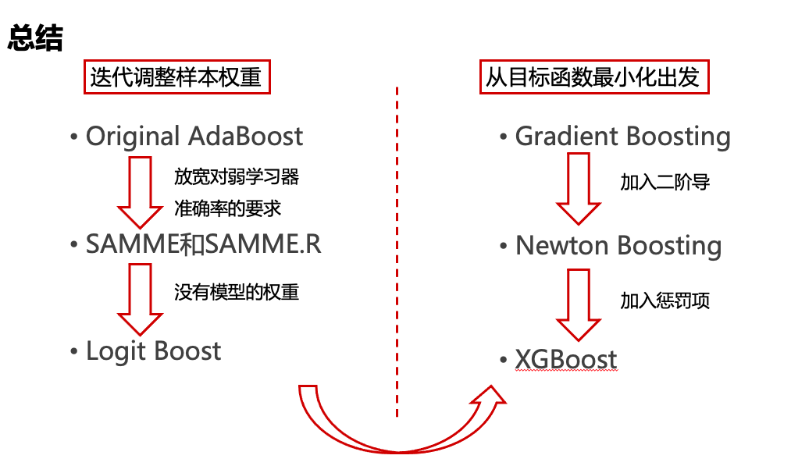

# 提升方法 (Boosting) {#boosting}

> Breiman called **AdaBoost** the **‘best off-the-shelf classifier in the world’** (NIPS Workshop 1996).

> On the data science competition platform Kaggle, among **29** challenge winning solutions in 2015, **17** used **XGBoost**, a boosting algorithm introduced by Chen and Guestrin.

**AdaBoost及相近算法**

AdaBoost是一种迭代算法，其核心思想是训练不同的分类器(弱分类器$T$)，然后把这些弱分类器线性组合起来，构成一个更强的最终分类器（强分类器$C$）。

该算法是一个简单的弱分类算法提升过程，这个过程通过不断的训练，可以提高对数据的分类能力。整个过程如下所示：

1. 通过对训练样本$(\mathcal{D},\mathbb{\omega})$的学习得到第$m-1$个弱分类器`WeakClassifier m-1`, $T^{(m-1)}$；

2. 计算得出其分类错误率$\epsilon^{(m-1)}$，以此计算出其弱分类器权重$\alpha^{(m-1)}$与数据权重$\omega^{(m-1)}_i$;

3. 用权重为$\omega^{(m-1)}_i$的数据集训练得到训练弱分类器`WeakClassifier m`, $T^{(m)}$;

4. 重复以上不断迭代的过程;

5. 最终结果通过加权投票表决的方法，让所有弱分类器$T^{(m)}$进行权重为$\alpha^{(m)}$的投票表决的方法得到最终预测输出。

```{r overview,echo=F,out.width="60%",fig.align = 'center'}
knitr::opts_chunk$set(fig.pos = "!H", out.extra = "")
knitr::include_graphics("./plots/4/overview.png")
```

- AdaBoost: Schapire and Freund (1997, 2012)

- LogitBoost: Friedman, Hastie, Tibshirani (1998)

- AdaBoost.M1: Schapire and Freund (1996, 1997)

- SAMME: Zhu, Zou, Rosset et al. (2006)

- SAMME.R: Zhu, Zou, Rosset et al. (2006)


**梯度提升算法**

核心思想: Gradient descent method and Newton's method. 

*Gradient descent method*

Minimize the following approximation over $y$,
$$f(y)\approx f(x)+\nabla f(x)^T(y-x) +\frac{1}{2t}||y-x||^2_2 $$
we have $y=x^+=x-t\nabla f(x)$.

*Newton's method*

Minimize the following approximation over $y$,
$$f(y)\approx f(x)+\nabla f(x)^T(y-x) +\frac{1}{2}(y-x)^T\nabla^2f(x)(y-x)$$
we have $y=x^+=x-\frac{\nabla f(x)}{\nabla ^2f(x)}$.

- Gradient Boost: Friedman (2001)

- Newton Boosting: Nielsen (2016)

- XGBoost: Chen and Guestrin (2016)

## AdaBoost

$Y\in\{0,1\}$

1. 初始权重 $\omega^{(0)}_i=\frac{1}{n}$.

2. 使用$(\mathcal{D},\mathbf{\omega}^{(m-1)})$，训练弱学习机$T^{(m-1)}$. 
  
3. 计算加权分类错误 $$\epsilon^{(m-1)}=\sum_{i=1}^n\omega^{(m-1)}_i \mathbb{I}(y_i \neq T^{(m-1)}(\mathbf{x}_i))$$
  
4. 计算模型权重 $\alpha^{(m-1)}=\ln\beta^{(m-1)}$, 其中$$\beta^{(m-1)}=\frac{1-\epsilon^{(m-1)}}{\epsilon^{(m-1)}}$$
  
5. 计算样本权重$$\omega^{(m)}_i=\omega^{(m-1)}_i\exp\left( \alpha^{(m-1)}\mathbb{I}(y_i \neq T^{(m-1)}(\mathbf{x}_i)) \right)/w^{(m)}$$, 其中$w^{(m)}$为标准化常数。
  
6. 最终预测结果为 $$C(\mathbf{x})= \underset{k}{\arg \max} \sum_{m=1}^M\alpha^{(m)}\mathbb{I}(T^{(m)}(\mathbf{x})=k)$$

**另外一种等价算法**

$Y\in\{-1,1\}$

1. 初始权重 $\omega^{(0)}_i=\frac{1}{n}$.

2. 使用$(\mathcal{D},\mathbf{\omega}^{(m-1)})$，训练弱学习机$T^{(m-1)}$. 
  
3. 计算加权分类错误 $$\epsilon^{(m-1)}=\sum_{i=1}^n\omega^{(m-1)}_i \mathbb{I}(y_i \neq T^{(m-1)}(\mathbf{x}_i))$$
  
4. 计算模型权重 $\alpha^{(m-1)}=\frac{1}{2}\ln\beta^{(m-1)}$, 其中$$\beta^{(m-1)}=\frac{1-\epsilon^{(m-1)}}{\epsilon^{(m-1)}}.$$
  
5. 计算样本权重$$\omega^{(m)}_i=\omega^{(m-1)}_i\exp\left(-\alpha^{(m-1)}y_i T^{(m-1)}(\mathbf{x}_i) \right)/w^{(m)},$$ 其中$w^{(m)}$为标准化常数。
  
6. 最终预测结果为$$C(\mathbf{x})= \underset{k}{\arg \max} \sum_{m=1}^M\alpha^{(m)}\mathbb{I}(T^{(m)}(\mathbf{x})=k)$$

## Logit Boost (real, discrete, gentle AdaBoost)

$Y\in\{-1,1\}$

1. 初始弱学习机 $T^{(0)}=0, C^{(0)}=0$.

2. 计算预测概率 $$p^{(m-1)}(Y_i|\mathbf{x_i})=\frac{1}{1+\exp(-Y_iT^{(m-1)}(\mathbf{x_i}))}$$

注：$$p^{(m-1)}(Y_i=1|\mathbf{x_i})+p^{(m-1)}(Y_i=-1|\mathbf{x_i})=1$$

3. 计算样本权重 $$\omega^{(m-1)}_i=p^{(m-1)}(Y_i=y_i|\mathbf{x_i})(1-p^{(m-1)}(Y_i=y_i|\mathbf{x_i}))$$ 

4. 计算工作因变量 $$z^{(m)}_i = y_i(1+\exp(-y_i C^{(m-1)}(\mathbf{x_i})))$$

5. 训练弱学习机$T^{(m)}$，使之最小化如下加权损失函数 $$\sum_{i=1}^N \omega_i^{(m-1)}(T^{(m)}(\mathbf{x_i})-z^{(m-1)}_i)^2$$

6. 令$C^{(m)}=C^{(m-1)}+T^{(m)}$

7. 最终预测概率为$$\Pr(Y=y|\mathbf{x})= \frac{1}{1+\exp(-yC^{(m)}(\mathbf{x_i}))}$$

## AdaBoost.M1

$Y\in\{1,\ldots,K\}$

1. 初始权重 $\omega^{(0)}_i=\frac{1}{n}$.

2. 使用$(\mathcal{D},\mathbf{\omega}^{(m-1)})$，训练弱学习机$T^{(m-1)}$. 
  
3. 计算加权分类错误 $$\epsilon^{(m-1)}=\sum_{i=1}^n\omega^{(m-1)}_i \mathbb{I}(y_i \neq T^{(m-1)}(\mathbf{x}_i))$$
  
4. 计算模型权重 $\alpha^{(m-1)}=\ln\beta^{(m-1)}$, 其中$$\beta^{(m-1)}=\frac{1-\epsilon^{(m-1)}}{\epsilon^{(m-1)}}$$
  
5. 计算样本权重$$\omega^{(m)}_i=\omega^{(m-1)}_i\exp\left( \alpha^{(m-1)}\mathbb{I}(y_i \neq T^{(m-1)}(\mathbf{x}_i)) \right)/w^{(m)}$$, 其中$w^{(m)}$为标准化常数。
  
6. 最终预测结果为 $$C(\mathbf{x})= \underset{k}{\arg \max} \sum_{m=1}^M\alpha^{(m)}\mathbb{I}(T^{(m)}(\mathbf{x})=k)$$

## SAMME (Stage-wise Additive Modeling using a Multi-class Exponential loss function)

$Y\in \{1,\ldots,K\}$

1. 初始权重 $\omega^{(0)}_i=\frac{1}{n}$.

2. 使用$(\mathcal{D},\mathbf{\omega}^{(m-1)})$，训练弱学习机$T^{(m-1)}$. 
  
3. 计算加权分类错误 $$\epsilon^{(m-1)}=\sum_{i=1}^n\omega^{(m-1)}_i \mathbb{I}(y_i \neq T^{(m-1)}(\mathbf{x}_i))$$
  
4. 计算模型权重 $$\alpha^{(m-1)}=\eta\left(\ln\beta^{(m-1)}+\ln (k-1)\right),$$ 其中$$\beta^{(m-1)}=\frac{1-\epsilon^{(m-1)}}{\epsilon^{(m-1)}}$$
  
5. 计算样本权重$$\omega^{(m)}_i=\omega^{(m-1)}_i\exp\left( \alpha^{(m-1)}\mathbb{I}(y_i \neq T^{(m-1)}(\mathbf{x}_i)) \right)/w^{(m)},$$ 其中$w^{(m)}$为标准化常数。
  
6. 最终预测结果为 $$C(\mathbf{x})= \underset{k}{\arg \max} \sum_{m=1}^M\alpha^{(m)}\mathbb{I}(T^{(m)}(\mathbf{x})=k)$$

## SAMME.R (multi-class real AdaBoost)

见<https://web.stanford.edu/~hastie/Papers/samme.pdf>

$Y\in \{1,\ldots,K\},\mathbf{Z}=(Z_1,\ldots,Z_k)'\in\{1,-1/(K-1)\}^K$, 建立映射$\{1,\ldots,K\}\rightarrow \{1,-1/(K-1)\}^K, Y\mapsto \mathbf{Z}(Y)$, 其中$Z_k(k)=1$, 且$Z_{k'}(k)=-1/(K-1), k'\neq k$

1. 初始权重 $\omega^{(0)}_i=\frac{1}{n}$.

2. 使用$(\mathcal{D},\mathbf{\omega}^{(m-1)})$，训练弱学习机$T^{(m-1)}$. 
  
3. 根据$T^{(m-1)}$计算(加权)预测频率 $$p_k^{(m-1)}(\mathbf{x})=\Pr(y=k|\mathbf{x}),$$ 令$\mathbf{p}^{(m-1)}(\mathbf{x})=(p_1^{(m-1)}(\mathbf{x}), \ldots,p_K^{(m-1)}(\mathbf{x}))'$
  
4. 计算模型(预测为$k$)权重 $$h^{(m-1)}_k(\mathbf{x})=(K-1)\left(\ln p^{(m-1)}_k(\mathbf{x})-\frac{1}{K}\sum_{k'\neq k} \ln p_{k'}^{(m-1)}(\mathbf{x})\right)$$
  
5. 计算样本权重$$\omega^{(m)}_i=\omega^{(m-1)}_i\exp\left( -\frac{K-1}{K}\mathbf{Z}(y_i)^{T}\ln p^{(m-1)}(x_i) \right)/w^{(m)},$$ 其中$w^{(m)}$为标准化常数。
  
6. 最终预测结果为 $$C(\mathbf{x})= \underset{k}{\arg \max} \sum_{m=1}^M h_k^{(m)}(\mathbf{x})$$

参考`Multiclass exponential loss` $$L(Z,f)=\exp\left(-\frac{1}{K}Z^Tf\right)$$

## Gradient Boosting


## Newton Boosting


## XGBoost


```{r summary,echo=F,out.width="60%",fig.align = 'center'}
knitr::opts_chunk$set(fig.pos = "!H", out.extra = "")

```

## Case study

### Commonly used Python code (for py-beginners)

