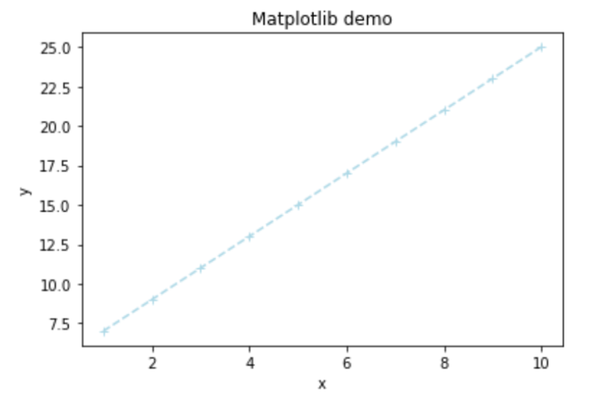

# 提升方法 (Boosting) {#boosting}

*范雨文、毛雪婷*

> Breiman called **AdaBoost** the **‘best off-the-shelf classifier in the world’** (NIPS Workshop 1996).

> On the data science competition platform Kaggle, among **29** challenge winning solutions in 2015, **17** used **XGBoost**, a boosting algorithm introduced by Chen and Guestrin.

**AdaBoost及相近算法**

AdaBoost是一种迭代算法，其核心思想是训练不同的分类器(弱分类器$T$)，然后把这些弱分类器线性组合起来，构成一个更强的最终分类器（强分类器$C$）。

该算法是一个简单的弱分类算法提升过程，这个过程通过不断的训练，可以提高对数据的分类能力。整个过程如下所示：

1. 通过对训练样本$(\mathcal{D},\mathbb{\omega})$的学习得到第$m-1$个弱分类器`WeakClassifier m-1`, $T^{(m-1)}$；

2. 计算得出其分类错误率$\epsilon^{(m-1)}$，以此计算出其弱分类器权重$\alpha^{(m-1)}$与数据权重$\omega^{(m-1)}_i$;

3. 用权重为$\omega^{(m-1)}_i$的数据集训练得到训练弱分类器`WeakClassifier m`, $T^{(m)}$;

4. 重复以上不断迭代的过程;

5. 最终结果通过加权投票表决的方法，让所有弱分类器$T^{(m)}$进行权重为$\alpha^{(m)}$的投票表决的方法得到最终预测输出。


- AdaBoost: Schapire and Freund (1997, 2012)

- LogitBoost: Friedman, Hastie, Tibshirani (1998)

- AdaBoost.M1: Schapire and Freund (1996, 1997)

- SAMME: Zhu, Zou, Rosset et al. (2006)

- SAMME.R: Zhu, Zou, Rosset et al. (2006)

**梯度提升算法**

核心思想: Gradient descent method and Newton's method. 

*Gradient descent method*

Minimize the following approximation over $y$,
$$f(y)\approx f(x)+\nabla f(x)^T(y-x) +\frac{1}{2t}||y-x||^2 $$
we have $y=x^+=x-t\nabla f(x)$.

*Newton's method*

Minimize the following approximation over $y$,
$$f(y)\approx f(x)+\nabla f(x)^T(y-x) +\frac{1}{2}(y-x)^T\nabla^2f(x)(y-x)$$
we have $y=x^+=x-\frac{\nabla f(x)}{\nabla ^2f(x)}$.

- Gradient Boost: Friedman (2001)

- Newton Boosting: Nielsen (2016)

- XGBoost: Chen and Guestrin (2016)

## AdaBoost

$Y\in\{0,1\}$

1. 初始权重 $\omega^{(0)}_i=\frac{1}{n}$.

2. 使用$(\mathcal{D},\mathbf{\omega}^{(m-1)})$，训练弱学习机$T^{(m-1)}$. 
  
3. 计算加权分类错误 $$\epsilon^{(m-1)}=\sum_{i=1}^n\omega^{(m-1)}_i \mathbb{I}(y_i \neq T^{(m-1)}(\mathbf{x}_i))$$
  
4. 计算模型权重 $\alpha^{(m-1)}=\ln\beta^{(m-1)}$, 其中$$\beta^{(m-1)}=\frac{1-\epsilon^{(m-1)}}{\epsilon^{(m-1)}}$$
  
5. 计算样本权重$$\omega^{(m)}_i=\omega^{(m-1)}_i\exp\left( \alpha^{(m-1)}\mathbb{I}(y_i \neq T^{(m-1)}(\mathbf{x}_i)) \right)/w^{(m)}$$, 其中$w^{(m)}$为标准化常数。
  
6. 最终预测结果为 $$C(\mathbf{x})= \underset{k}{\arg \max} \sum_{m=1}^M\alpha^{(m)}\mathbb{I}(T^{(m)}(\mathbf{x})=k)$$

**另外一种等价算法**

$Y\in\{-1,1\}$

1. 初始权重 $\omega^{(0)}_i=\frac{1}{n}$.

2. 使用$(\mathcal{D},\mathbf{\omega}^{(m-1)})$，训练弱学习机$T^{(m-1)}$. 
  
3. 计算加权分类错误 $$\epsilon^{(m-1)}=\sum_{i=1}^n\omega^{(m-1)}_i \mathbb{I}(y_i \neq T^{(m-1)}(\mathbf{x}_i))$$
  
4. 计算模型权重 $\alpha^{(m-1)}=\frac{1}{2}\ln\beta^{(m-1)}$, 其中$$\beta^{(m-1)}=\frac{1-\epsilon^{(m-1)}}{\epsilon^{(m-1)}}.$$
  
5. 计算样本权重$$\omega^{(m)}_i=\omega^{(m-1)}_i\exp\left(-\alpha^{(m-1)}y_i T^{(m-1)}(\mathbf{x}_i) \right)/w^{(m)},$$ 其中$w^{(m)}$为标准化常数。
  
6. 最终预测结果为$$C(\mathbf{x})= \underset{k}{\arg \max} \sum_{m=1}^M\alpha^{(m)}\mathbb{I}(T^{(m)}(\mathbf{x})=k)$$

## Logit Boost (real, discrete, gentle AdaBoost)

$Y\in\{-1,1\}$

1. 初始弱学习机 $T^{(0)}=0, C^{(0)}=0$.

2. 计算预测概率 $$p^{(m-1)}(Y_i|\mathbf{x_i})=\frac{1}{1+\exp(-Y_iT^{(m-1)}(\mathbf{x_i}))}$$ 注：$$p^{(m-1)}(Y_i=1|\mathbf{x_i})+p^{(m-1)}(Y_i=-1|\mathbf{x_i})=1$$

3. 计算样本权重 $$\omega^{(m-1)}_i=p^{(m-1)}(Y_i=y_i|\mathbf{x_i})(1-p^{(m-1)}(Y_i=y_i|\mathbf{x_i}))$$ 

4. 计算工作因变量 $$z^{(m)}_i = y_i(1+\exp(-y_i C^{(m-1)}(\mathbf{x_i})))$$

5. 训练弱学习机$T^{(m)}$，使之最小化如下加权损失函数 $$\sum_{i=1}^N \omega_i^{(m-1)}(T^{(m)}(\mathbf{x_i})-z^{(m-1)}_i)^2$$

6. 令$C^{(m)}=C^{(m-1)}+T^{(m)}$

7. 最终预测概率为$$\Pr(Y=y|\mathbf{x})= \frac{1}{1+\exp(-yC^{(m)}(\mathbf{x_i}))}$$

## AdaBoost.M1

$Y\in\{1,\ldots,K\}$

1. 初始权重 $\omega^{(0)}_i=\frac{1}{n}$.

2. 使用$(\mathcal{D},\mathbf{\omega}^{(m-1)})$，训练弱学习机$T^{(m-1)}$. 
  
3. 计算加权分类错误 $$\epsilon^{(m-1)}=\sum_{i=1}^n\omega^{(m-1)}_i \mathbb{I}(y_i \neq T^{(m-1)}(\mathbf{x}_i))$$
  
4. 计算模型权重 $\alpha^{(m-1)}=\ln\beta^{(m-1)}$, 其中$$\beta^{(m-1)}=\frac{1-\epsilon^{(m-1)}}{\epsilon^{(m-1)}}$$
  
5. 计算样本权重$$\omega^{(m)}_i=\omega^{(m-1)}_i\exp\left( \alpha^{(m-1)}\mathbb{I}(y_i \neq T^{(m-1)}(\mathbf{x}_i)) \right)/w^{(m)},$$ 其中$w^{(m)}$为标准化常数。
  
6. 最终预测结果为 $$C(\mathbf{x})= \underset{k}{\arg \max} \sum_{m=1}^M\alpha^{(m)}\mathbb{I}(T^{(m)}(\mathbf{x})=k)$$

## SAMME (Stage-wise Additive Modeling using a Multi-class Exponential loss function)

$Y\in \{1,\ldots,K\}$

1. 初始权重 $\omega^{(0)}_i=\frac{1}{n}$.

2. 使用$(\mathcal{D},\mathbf{\omega}^{(m-1)})$，训练弱学习机$T^{(m-1)}$. 
  
3. 计算加权分类错误 $$\epsilon^{(m-1)}=\sum_{i=1}^n\omega^{(m-1)}_i \mathbb{I}(y_i \neq T^{(m-1)}(\mathbf{x}_i))$$
  
4. 计算模型权重 $$\alpha^{(m-1)}=\eta\left(\ln\beta^{(m-1)}+\ln (k-1)\right),$$ 其中$$\beta^{(m-1)}=\frac{1-\epsilon^{(m-1)}}{\epsilon^{(m-1)}}$$
  
5. 计算样本权重$$\omega^{(m)}_i=\omega^{(m-1)}_i\exp\left( \alpha^{(m-1)}\mathbb{I}(y_i \neq T^{(m-1)}(\mathbf{x}_i)) \right)/w^{(m)},$$ 其中$w^{(m)}$为标准化常数。
  
6. 最终预测结果为 $$C(\mathbf{x})= \underset{k}{\arg \max} \sum_{m=1}^M\alpha^{(m)}\mathbb{I}(T^{(m)}(\mathbf{x})=k)$$

## SAMME.R (multi-class real AdaBoost)

见<https://web.stanford.edu/~hastie/Papers/samme.pdf>

$Y\in \{1,\ldots,K\},\mathbf{Z}=(Z_1,\ldots,Z_k)'\in\{1,-1/(K-1)\}^K$, 建立映射$\{1,\ldots,K\}\rightarrow \{1,-1/(K-1)\}^K, Y\mapsto \mathbf{Z}(Y)$, 其中$Z_k(k)=1$, 且$Z_{k'}(k)=-1/(K-1), k'\neq k$

1. 初始权重 $\omega^{(0)}_i=\frac{1}{n}$.

2. 使用$(\mathcal{D},\mathbf{\omega}^{(m-1)})$，训练弱学习机$T^{(m-1)}$. 
  
3. 根据$T^{(m-1)}$计算(加权)预测频率 $$p_k^{(m-1)}(\mathbf{x})=\Pr(y=k|\mathbf{x}),$$ 令$\mathbf{p}^{(m-1)}(\mathbf{x})=(p_1^{(m-1)}(\mathbf{x}), \ldots,p_K^{(m-1)}(\mathbf{x}))'$
  
4. 计算模型(预测为$k$)权重 $$h^{(m-1)}_k(\mathbf{x})=(K-1)\left(\ln p^{(m-1)}_k(\mathbf{x})-\frac{1}{K}\sum_{k'\neq k} \ln p_{k'}^{(m-1)}(\mathbf{x})\right)$$
  
5. 计算样本权重$$\omega^{(m)}_i=\omega^{(m-1)}_i\exp\left( -\frac{K-1}{K}\mathbf{Z}(y_i)^{T}\ln p^{(m-1)}(x_i) \right)/w^{(m)},$$ 其中$w^{(m)}$为标准化常数。
  
6. 最终预测结果为 $$C(\mathbf{x})= \underset{k}{\arg \max} \sum_{m=1}^M h_k^{(m)}(\mathbf{x})$$

参考`Multiclass exponential loss` $$L(Z,f)=\exp\left(-\frac{1}{K}Z^Tf\right)$$

## Gradient Boosting

$Y\in\{-1,1\}$，设定学习率$\eta\in(0,1]$

1. 初始弱学习器
$$f_0(\mathbf{x})= \underset{\theta\in\mathbb{R}}{\arg \min} \sum_{i=1}^n L(Y_i, \theta)$$

2. 计算第$m$次迭代中,损失函数的负梯度$$g_m(\mathbf{x_i}) = - \frac{\partial L(Y_i, f_i)}{\partial f_{m-1,i}}$$

3. 求解弱学习器$T^m$参数 $$h_m^{*} = \underset{h\in\mathcal{F},\beta}{\arg \min} \sum_{i=1}^n(g_m(\mathbf{x_i}) - \beta h(\mathbf{x_i}))^2 $$

4. 通过线搜索得到步长 $$\rho_m = \underset{\rho>0}{\arg \min} \sum_{i=1}^n L(Y_i,f_{m-1}(\mathbf{x_i}) + \rho h_m^{*}(\mathbf{x_i}))$$

5. shrinkage，乘以提前给定的学习率 $$f_m^{*} = \eta\rho_m h_m^{*}$$

6. 更新，前$m$个弱学习器的线性组合 $$f_m(\mathbf{x}) = f_{m-1}(\mathbf{x}) + f_{m}^*(\mathbf{x}) $$

7. 最终预测结果为 $f_M(\mathbf{x})$ 

## Newton Boosting

$Y\in\{-1,1\}$，设定学习率$\eta\in(0,1]$

1. 初始弱学习器$$f_0(\mathbf{x})= \underset{\theta\in\mathbb{R}}{\arg \min} \sum_{i=1}^n L(Y_i, \theta)$$

2. 计算第$m$次迭代中的负梯度$$g_m(\mathbf{x_i}) = - \frac{\partial L(Y_i, \theta)}{\partial f_{m-1,i}}$$

3. 计算Hessian Matrix $$H_m(\mathbf{x_i}) = (\nabla^2\mathcal{L}(\mathbb{f_{m-1}}))_{ii}$$

4. 求解弱学习器$T^m$参数$$h_m^{*} = \underset{h\in\mathcal{F}}{\arg \min} \sum_{i=1}^n(\frac{g_m(\mathbf{x_i})}{H_m(\mathbf{x_i})} + \frac{1}{2} H_m(\mathbf{x_i})h(\mathbf{x_i}))^2 \\ 
= \underset{h\in\mathcal{F}}{\arg \min} \sum_{i=1}^n\frac{1}{2} H_m(\mathbf{x_i})(-\frac{g_m(\mathbf{x_i})}{H_m(\mathbf{x_i})} - h(\mathbf{x_i}))^2 $$

5. shrinkage，乘以提前给定的学习率$$f_m^{*} = \eta h_m^{*}$$

6. 更新，前$m$个弱学习器的线性组合 $$f_m(\mathbf{x}) = f_{m-1}(\mathbf{x}) + f_{m}^*(\mathbf{x}) $$

7. 最终预测结果为 $f_M(\mathbf{x})$ 


## XGBoost

1. objective function: 
$$\mathcal{L} =\sum_{i=1}^n L(\hat{y_i},y_i) + \sum_{m=1}^M\Omega(f_m)$$ where $L(\hat{y_i},y_i)$ is a differential convex loss function and $\Omega(f_m) = \gamma T + \frac{1}{2}\lambda||\omega||^2$ is a regularization term to penalize model complexity (including number of leaves $T$ and $L^2$-norm of leaf scores $\omega$)

2. Newton approximation of objective function:
$$\tilde{\mathcal{L}}^m = \sum_{i=1}^n \lbrack L(\hat{y_i}^{m-1},y_i) + g_if_m(\mathbf{x_i}) + \frac{1}{2}h_if_m^2(\mathbf{x_i}) \rbrack+\Omega(f_m) $$ where $g_i = \frac{\partial L}{\partial\hat{y_i}^{m-1}}|_{(\hat{y_i}^{m-1}, y_i)}$ and $h_i= \frac{\partial^2 L}{\partial\hat{y_i}^{m-1}\partial\hat{y_i}^{m-1}}|_{(\hat{y_i}^{m-1}, y_i)}$

3. 最小化上述式子，得到the optimal score (or weight) $\omega_j^*$ of leaf $j\in\{1,\dots,T\}$is:$$ \omega_j^*=-\frac{\sum_{i=1}^n g_i \mathbb{I}[q(\mathbf{x_i}) = j]}{\lambda + \sum_{i=1}^nh_i\mathbb{I}[q(\mathbf{x_i}) = j]} $$


## Case study

本案例的数据来源于Kaggle上的比赛“Porto Seguro's Safe Driver Prediction Competition”。

比赛的目标是预测未来一年司机是否会发生交通事故，是一个**二分类**问题。此案例中，所有的数据都经过了匿名化处理。

### 数据描述

数据包含595212条记录，59个变量。

变量包含三类：

- 唯一编码（1个）：`id`
- 目标变量（1个）：`target`，取值为$\{0, 1\}$
- 解释变量（57个）：`ps_*`，包括四种，分别是二分类变量（binary），多分类变量（categorical），连续型变量（continuous），定序变量（ordinal）。

此案例中，缺失值用-1表示。


### 数据预处理

1. 统计缺失值

数据中，`ps_car_03_cat`和`ps_car_05_cat`的缺失值较多，缺失值分别占69.09%和44.78%，之后将进行缺失值处理。


2. 单变量分析

对于不同类型的解释变量，我们将依照不同的方法进行处理。

- 分类变量，统计各个类别的占比

- 定距和定序变量，作条形图

- 数值型变量，作直方图

对于目标变量，我们发现它的取值非常不平衡。


```python
# levels for the target variable 
lev_target = ( pd.crosstab(index = data['target'], columns = 'Frequency') / data.shape[0] ) * 100
lev_target.round(2)
```

通常来说，处理**不平衡**的分类数据，我们可以采取如下方法：

- SMOTE（Synthetic Minority Oversampling Technique）

- 上采样（Over-sampling）

- 下采样（Under-sampling）

- 加权抽样（Sampling Weighting）

- 成本敏感训练（Cost-sensitive Training）

3. 多变量分析

在不同的解释变量之间，我们可以作相关系数矩阵热图和散点图矩阵。

- 相关系数矩阵热图


```python
# Pearson correlation matrix: computation and visualization

# use method='pearson' resp. method='spearman' to compute Pearson resp. Spearman correlations
def corr_heatmap(v):
    correlations = data[v].corr(method='pearson')
    fig = plt.subplots(figsize=(10, 10))

    sns.heatmap(correlations,  center=0, fmt='.2f', cbar=False,
                square=True, linewidths=1, annot=True,  cmap="YlGnBu")
    plt.xticks(rotation=90) 
    plt.yticks(rotation=0) 
    plt.show()

# one applies the corr_heatmap function on the interval features    
v = meta[(meta.level == 'interval') & (meta.keep)].index
corr_heatmap(v)
```


- 散点图矩阵


```python
# scatterplot high correlation interval variables
import seaborn
high = pd.Index(['ps_reg_01', 'ps_reg_02', 'ps_reg_03', 'ps_car_12', 'ps_car_13', 'ps_car_15'])
pd.plotting.scatter_matrix(data[high], alpha = 0.2, figsize = (40, 40), diagonal = 'kde')
```


在解释变量和目标变量之间，我们可以作散点图、箱线图、条形图等。


### 特征工程

1. 删除变量

为了简化分析、提升计算速度，删除14个定距变量（interval）和定序变量（ordinal）
`ps_calc_01`，`ps_calc_02`，`ps_calc_03`，`ps_calc_04`，`ps_calc_05`，`ps_calc_06`，`ps_calc_07`，`ps_calc_08`，`ps_calc_09`，`ps_calc_10`，`ps_calc_11`，`ps_calc_12`，`ps_calc_13`，`ps_calc_14`。

2. 缺失值处理

- 删除缺失值较多的变量`ps_car_03_cat`和`ps_car_05_cat`

- 均值插补连续型变量`ps_reg_03`，`ps_car_12`和`ps_car_14`

- 众数插补分类变量`ps_car_11`


```python
# dropping 'ps_car_03_cat', 'ps_car_05_cat' and updating meta information
vars_to_drop = ['ps_car_03_cat', 'ps_car_05_cat']
data.drop(vars_to_drop, inplace = True, axis = 1)
meta.loc[(vars_to_drop), 'keep'] = False  

# imputing with the mean or mode using Imputer from sklearn.preprocessing
from sklearn.preprocessing import Imputer

mean_imp = Imputer(missing_values = -1, strategy = 'mean', axis = 0)
mode_imp = Imputer(missing_values = -1, strategy = 'most_frequent', axis = 0)

data['ps_reg_03'] = mean_imp.fit_transform(data[['ps_reg_03']]).ravel()
data['ps_car_12'] = mean_imp.fit_transform(data[['ps_car_12']]).ravel()
data['ps_car_14'] = mean_imp.fit_transform(data[['ps_car_14']]).ravel()
data['ps_car_11'] = mode_imp.fit_transform(data[['ps_car_11']]).ravel()
```

3. 生成哑变量


```python
# creating dummy variables
data = pd.get_dummies(data, columns = v, drop_first = True)
print('After dummification we have {} variables in data'.format(data.shape[1]))
```

4. 划分学习集和测试集

以80:20的比例划分学习集和测试集，分别记作`(X_train, y_train)`和`(X_test, y_test)`。

经过划分，学习集有476169条记录，测试集有119043条记录。模型将会在学习集上训练，然后在测试集上分析其表现。


```python
X_train, X_test, y_train, y_test = train_test_split(data.drop(['id', 'target'], axis=1), 
                                                    data['target'], 
                                                    test_size=0.2,
                                                    random_state=random_state
                                                   )
```


### 建模流程

| |模型编号|建模过程|
| ----- | :---: | --------------- |
|基准模型 Baseline modeling | ST0 | 用默认参数训练模型 (no cv, no tunning) |
|深入建模 In-depth modeling | ST1, ST2 | 包括参数调整(`iteration`, `depth`, `learning rate`)、交叉验证、外样本测试<br><br>整体步骤为：<br>1.选择若干套参数 (hyper parameter tuning)<br>2.对于每套参数，在`X_train`上进行训练和交叉验证，计算每一折的表现<br>(先用1-4折训练，计算第5折的cv error；再用第1-3和5折训练，计算第4折的cv error；依次类推)<br>3.计算每套参数的平均表现(GINI，AUC，accuracy，logit loss function)<br>4.选择表现最好的一套参数在`X_train`上训练，作为最优模型<br>5.在`X_test`上对最优模型进行测试 |

### 模型度量——Gini系数

1. Gini系数

Gini系数是度量模型表现的一个指标，它的计算公式为：

$$Gini_{CAP} = \frac {a_R} {a_P}$$

其中，$a_R$是某一模型CAP曲线和随机猜模型CAP曲线间的面积，$a_P$是完美模型CAP曲线和随机猜模型CAP曲线间的面积。

2. Gini系数案例

[Gini Coefficient - An Intuitive  Explanation](https://www.kaggle.com/batzner/gini-coefficient-an-intuitive-explanation)


$$Gini = \frac {0.189} {0.3} = 0.630$$

3. Gini系数代码

在python中，我们可以用如下代码来定义Gini系数。


```python
from sklearn.metrics import make_scorer

# Gini coefficient
def gini(actual, pred):
    
    # a structural check
    assert (len(actual) == len(pred))
    
    # introducing an array called all
    all = np.asarray(np.c_[actual, pred, np.arange(len(actual))], dtype=np.float)  #slicing along second axis
    
    # sorting the array along predicted probabilities (descending order) and along the index axis all[:, 2] in case of ties
    all = all[np.lexsort((all[:, 2], -1 * all[:, 1]))]                             #

    # towards the Gini coefficient
    totalLosses = all[:, 0].sum()
    giniSum = all[:, 0].cumsum().sum() / totalLosses

    giniSum -= (len(actual) + 1) / 2.
    return giniSum / len(actual)

# normalized Gini coefficient
def gini_normalized_score(actual, pred):
    return gini(actual, pred) / gini(actual, actual)

# score using the normalized Gini
score_gini = make_scorer(gini_normalized_score, greater_is_better=True, needs_threshold = True)
```

4. Gini系数与AUC

Gini系数与AUC之间存在如下等式关系：

$$Gini = 2 \times AUC - 1$$

在此例中，Gini系数将用于计算交叉验证中模型在验证集上的表现。

### 建立AdaBoost模型

#### ST0

选取tree作为基模型，构建SAMME和SAMME.R模型。

默认参数：`n_estimators = 50`，`learning_rate = 1`


SAMME.R模型的表现优于SAMME模型。

#### ST1

构建SAMME.R模型，选取参数`n_estimators = 500`，`learning_rate = 1`，观察不同`max_depth`下外样本测试的AUC。

左图`max_depth = 1`，右图`max_depth = 3`。


当`max_depth = 1`时，测试集上，SAMME.R的最大AUC为**0.639**，在迭代267次时取得；

当`max_depth = 3`时，测试集上，SAMME.R的最大AUC为0.624，在迭代8次时取得，出现了过拟合；

当`max_depth = 5`，迭代极少的次数就出现了过拟合。

因此，当增加树的最大深度时，容易出现过拟合，这时需要降低学习率以避免过拟合。

#### ST2

接下来，设置不同的`max_depth`、`learning_rate`、`n_estimators`，构建SAMME.R模型，搜寻外样本测试上AUC最大的模型。


可以看出，最佳模型的参数是`max_depth = 1`，`learning rate = 0.1`，`n_estimators = 400`，此时AUC为**0.637**。

### 建立XGBoost模型

#### ST0

采用默认参数：`learning rate = 0.1`，`max_depth = 3`，`n_estimators = 100`，构建XGBoost模型。

得出out-of-sample AUC为**0.638**，这已经好于AdaBoost的ST0（0.635）和ST2（0.637），稍差于ST1（0.639）。

#### ST1

设置不同的`max_depth`、`learning_rate`、`n_estimators`，构建XGBoost模型，搜寻外样本测试上AUC最大的模型。


可以看到，在`max_depth = 2`，`learning_rate = 0.1`，`n_estimators = 500`和`max_depth = 3`，`learning_rate = 0.1`，`n_estimators =  300`，AUC都取到了最大为**0.643**。

特征重要性排序如下图。


### 结论

总的来说，在此数据集上:

SAMME.R优于SAMME，SAMME.R在单层树、适度的学习率和较大的迭代次数上表现较好；

XGBoost优于AdaBoost，XGBoost在较浅的树、适度的学习率和较大的迭代次数上表现较好。

## Appendix: Commonly used Python code (for py-beginners)

### Python标准数据类型

- Numbers（数字）：用于存储数值，包括int，long，float和complex。

- String（字符串）：由数字、字母、下划线组成的一串字符。

- List（列表）：Python中使用最频繁的数据类型，可以完成大多数集合类的数据结构实现，它支持数字、字符串甚至可以包含列表（即嵌套）。

- Tuple（元组）：元组不能二次赋值，相当于“只读”列表。

- Dictionary（字典）：除列表以外python之中最灵活的内置数据结构类型，与列表的区别在于——列表是有序的对象集合，字典是无序的对象集合，字典当中的元素是通过键来存取的。


```python
n = 3.6  # 数字
s = 'Hello, python!'  # 字符串
L = [1, 2, 'a']  # 列表
t = (1, 2, 'a')  # 元组
d = {'a':1, 'b':2}  # 字典
print(n, s, L, t, d, sep = '\n\n')
```

### Python内置函数

1. 输入输出

- `print()`将对象输出至控制台

- `open()`打开文件并返回文件对象

- `input()`获取控制台输入

2. 迭代相关

- `enumerate()`返回元素的序号与对应值

- `zip()`将多个序列中的元素配对，产生新的元组列表

- `all()`如果给定的可迭代参数中的所有元素都为True则返回True，否则返回False

- `any()`如果给定的可迭代参数中的任一元素为True则返回True，否则返回False

3. 序列属性

- `max()`序列最大值

- `min()`序列最小值

- `sum()`序列的和   

- `len()`序列长度   

4. 序列操作

- `range()`生成序列
 
- `reversed()`将序列逆置

- `sorted()`对序列进行排序

5. 对象属性

- `dir()`返回属性列表

- `id()`返回对象地址

- `isinstance()`判断对象的类型

- `type`返回对象的类型

6. 映射类型

- `eval()`去除字符串的单引号，从而获取引号内部内容

- `map()`将传进来的函数应用于序列中的每一个元素，并返回迭代器

- `slice()`生成切片

### numpy包

NumPy(Numerical Python)是Python的一个扩展程序库，支持大量的维度数组与矩阵运算，它也针对数组运算提供大量的数学函数库。

1. 创建ndarray数组

ndarray是一种多维数组对象，其中的所有元素必须是相同类型的。


```python
import numpy as np 
a1 = np.array([[1, 2, 3], [4, 5, 6]])  # 创建数组
print(a1)
print(a1.ndim)  # 数组的维度
print(a1.shape)  # 数组的形状
print(a1.dtype)  # 数组的元素类型
print(a1.itemsize)  # 每个元素的字节单位长度

# 其他创建数组的方法
a2 = np.zeros(shape = (2,2), dtype = float)  # 创建元素全是0的数组
a3 = np.ones(shape = (2,2), dtype = int)  # 创建元素全是1的数组
a4 = np.arange(start = 10, stop = 20, step = 2)  # 创建指定数据范围的数组
print(a1, a2, a3, a4, sep = '\n\n')
```

2. ndarray对象的切片和索引


```python
import numpy as np
a = np.arange(24).reshape((2, 3, 4))  # 创建2维、3行、4列的数组，元素从0-23填充
print(a[0, 0:2, 1:3])  # 索引第1个数组第1-2行第2-3列
```


```python
import numpy as np
arr = np.arange(10)  # 创建元素为0-9的一维数组
arr_s = arr[3:5]  # 切片，提出数组的第4、5个元素
arr_s[:] = 99  # 将99赋值给切片arr_s中的所有元素
print(arr_s, arr, sep = '\n\n')  # 修改会直接反映到源数组上
```

3. 数学运算


```python
import numpy as np
a = np.array([1.0, 5.55, 123, 0.567, 25.532])  
b = np.arange(1, 6, 1)

print(np.around(a, decimals = 1))  # 四舍五入至1位小数
print(np.floor(a))  # 向下取整
print(np.ceil(a))  # 向上取整

print(np.sqrt(a))  # 开根号
print(np.square(a))  # 平方
print(np.log(a))  # 取对数
print(np.exp(a))  # 取指数
print(np.sign(a))  # 取符号函数

print(np.add(a, b))  # 两个数组相加
print(np.subtract(a, b))  # 两个数组相减
print(np.multiply(a, b))  # 两个数组相乘
print(np.divide(a, b))  # 两个数组相除
```

4. 统计运算


```python
import numpy as np 
a = np.array([[3, 7, 5], [8, 4, 3], [2, 4, 9]])  

print(np.min(a, axis = 0))  # 沿纵轴的最小值
print(np.max(a, axis = 1))  # 沿横轴的最大值        # 以下函数均可以通过参数axis选择纵轴（axis=0）或横轴（axis=1）
print(np.ptp(a))  # 数组中元素最大值与最小值的差
print(np.percentile(a, q = 70, axis = 0))  # 百分位数
print(np.sum(a))  # 求和
print(np.median(a))  # 中位数
print(np.mean(a))  # 均值
print(np.average(a, axis = 0, weights = [3, 2, 1], returned = True))  # 加权平均数
print(np.std(a))  # 标准差
print(np.var(a))  # 方差
```

5. 排序


```python
import numpy as np 
a = np.array([("raju",21), ("anil",25), ("ravi",17), ("amar",27)], dtype = np.dtype([('name','S10'), ('age',int)]))

print(a)
print(np.sort(a, order = 'age'))  # 从小到大排序
print(np.argsort(a, order = 'age'))  # 从小到大排序的索引
```

6. 线性代数


```python
import numpy as np 
a = np.arange(6).reshape(2, 3)
b = np.arange(6).reshape(3, 2)
c = a.copy()  # 复制

print(a)
print(a.T)  # 转置
print(np.dot(a,b))  # 数组点积
print(np.vdot(a,b))  # 向量点积, 多维数组会被展开
print(np.inner(a,c))  # 向量内积，对于更高的维度，它返回最后一个轴上的和的乘积
```


```python
import numpy as np
a = np.arange(4).reshape(2, 2)
print(a)
print(np.diag(a))  # 对角阵
print(np.linalg.inv(a))  # 逆
print(np.linalg.det(a))  # 行列式
print(np.linalg.eig(a))  # 特征值与特征向量
print(np.linalg.svd(a))  # 奇异值分解
```

7. 随机数


```python
import numpy as np
np.random.seed(123)  # 随机数种子

print(np.random.rand(2, 2))  # 均匀分布
print(np.random.randn(2, 3)) # 标准正态分布
print(np.random.randint(low = 0, high = 100, size = (2, 2)))  # 随机整数

# 分布
print(np.random.normal(loc = 3, scale = 9, size = 2))  # 正态
print(np.random.poisson(lam = 10, size = 6))  # 泊松
print(np.random.binomial(n = 10, p = 0.1, size = (2, 2)))  # 二项
print(np.random.negative_binomial(n = 10, p = 0.1, size = 1))  # 负二项
print(np.random.gamma(shape = 3, scale = 2, size = 10))  # 伽马
```

### pandas包

pandas是基于NumPy的一个为解决数据分析任务而创建的包，提供了大量能使我们快速便捷地处理数据的函数和方法。

1. 创建DataFrame


```python
import pandas as pd

data1 = pd.read_csv('file.csv', encoding = 'gbk')  # 从外部读入csv文件

data2 = {'state': ['Ohio', 'Ohio', 'Ohio', 'Nevada', 'Nevada'],  # 先创建字典
        'year': [2000, 2001, 2002, 2001, 2002],
        'pop': [1.5, 1.7, 3.6, 2.4, 2.9]}
data2 = pd.DataFrame(data2, columns = ['year', 'state', 'pop'])  # 基于字典创建DataFrame
data2['debt'] = 16.5  # 新增一列debt

print(data1, data2, sep = '\n\n')

print(data2.dtypes)  # 元素类型
print(data2.columns)  # 列名
print(data2.shape)  # 形状
print(data2.head(10))  # 看前10条记录
print(data2.tail(5))  # 看后5条记录
```

2. 索引


```python
import pandas as pd
data = {'state': ['Ohio', 'Ohio', 'Ohio', 'Nevada', 'Nevada'],
        'year': [2000, 2001, 2002, 2001, 2002],
        'pop': [1.5, 1.7, 3.6, 2.4, 2.9]}
data = pd.DataFrame(data, columns = ['year', 'state', 'pop'])
data['debt'] = 16.5

print(data)
print(data[0:2])  # 索引第1-2行
print(data.iloc[0:2])  # 索引第1-2行
print(data.loc[0:2])  # 索引index为0-2的行
print(data['year'])  # 索引名为year的列
print(data.loc[0,'year'])
print(data.iloc[0:2, 0:2])  # 索引第1-2行、第1-2列

print(data[data['pop']>2])  # 索引pop>2的行
print(data[(data['pop']>2) & (data['state'] == 'Ohio')])  # 索引pop>2且state是Ohio的行
print(data[(data['pop']>2) & (data['state'] == 'Ohio')][['year', 'debt']])  # 索引pop>2且state是Ohio的行、名为year和debt的列
```

3. 数据预处理


```python
import pandas as pd
data = {'state': ['Ohio', 'Ohio', 'Ohio', 'Nevada', 'Nevada'],
        'year': [2000, 2001, 2001, 2001, 2002],
        'pop': [1.5, 1.7, 1.7, 2.4, None]}
data = pd.DataFrame(data, columns = ['year', 'state', 'pop'])
data['debt'] = 16.5
print(data)
print(data.drop_duplicates())  # 删除重复行
print(data.dropna(axis = 0, how = "any"))  # 删除有缺失值的行
print(data.drop(['debt'], axis = 1))  # 删除列debt

print(pd.get_dummies(data, drop_first = True))  # 生成哑变量
```

4. 排序

```python
import pandas as pd
data = {'state': ['Ohio', 'Ohio', 'Ohio', 'Nevada', 'Nevada'],
        'year': [2000, 2001, 2002, 2001, 2002],
        'pop': [1.5, 1.7, 3.6, 2.4, 2.9]}
data = pd.DataFrame(data, columns = ['year', 'state', 'pop'])
data['debt'] = 16.5

print(data.sort_values(by = 'year', ascending = True))  # 按照year的值升序
print(data.sort_index(axis = 1))  # 按照列索引升序
print(data.rank())  # 求秩
```

5. 统计分析


```python
import pandas as pd
data = {'state': ['Ohio', 'Ohio', 'Ohio', 'Nevada', 'Nevada'],
        'year': [2000, 2001, 2002, 2001, 2002],
        'pop': [1.5, 1.7, 3.6, 2.4, 2.9]}
data = pd.DataFrame(data, columns = ['year', 'state', 'pop'])
data['debt'] = 16.5

print(data.describe())  # 对每列计算基本统计量
print(data.count())  # 计数
print(data.max())  # 最大值
print(data.min())  # 最小值
print(data.sum())  # 和
print(data.mean())  # 均值
print(data.median())  # 中位数
print(data.var())  # 方差
print(data.std())  # 标准差
print(data.cov())  # 协方差
print(data.corr())  # 相关系数
```

### Matplotlib包

Matplotlib是一个Python 的2D绘图库，它以各种硬拷贝格式和跨平台的交互式环境生成出版质量级别的图形。

1. 折线图


```python
import numpy as np 
from matplotlib import pyplot as plt 
 
x = np.arange(1,11) 
y = 2*x + 5 

plt.title('Matplotlib demo') 
plt.xlabel('x') 
plt.ylabel('y') 
plt.plot(x, y, ls = '--', marker = '+', color = 'lightblue')  # ls为线型，marker为标记类型
plt.show()
```



2. 散点图


```python
import numpy as np 
from matplotlib import pyplot as plt 

x = np.random.random(100)
y = np.random.random(100)

plt.scatter(x, y, s=x*1000, color='pink', marker=(5,1), alpha=0.5, lw=2)  # s为图像大小，lw为图像边框宽度
plt.show()
```


3. 箱线图


```python
import numpy as np
from matplotlib import pyplot as plt
x = np.random.gamma(shape = 3, scale = 2, size = 10)

plt.boxplot(x, vert=True)  # vert控制方向
plt.show()
```


4. 条形图


```python
import numpy as np 
from matplotlib import pyplot as plt

x_index = np.arange(5)   #柱的索引
x_data = ['A', 'B', 'C', 'D', 'E']
y1_data = [20, 35, 30, 35, 27]
y2_data = [25, 32, 34, 20, 25]

plt.bar(x_index, y1_data, width=0.35, alpha=0.8, color='lightblue', label='y1')  # 参数：左偏移、高度、柱宽、透明度、颜色、图例
plt.bar(x_index + 0.35, y2_data, width=0.35, alpha=0.8, color='pink', label='y2')

plt.xticks(x_index + bar_width/2, x_data)  # x轴刻度线
plt.legend()  # 显示图例
plt.show()
```


5. 直方图


```python
import numpy as np 
from matplotlib import pyplot as plt

x = np.random.randn(10000)

plt.hist(x, bins=40, density=True, histtype='bar', color='lightblue')
plt.show()
```


6. 饼图


```python
from matplotlib import pyplot as plt

labels = ['A', 'B', 'C', 'D']
x = [15, 30, 45, 10]
explode = (0, 0.1, 0, 0)
colors = ['pink', 'tomato', 'lightblue', 'lightyellow']
    
plt.pie(x, labels=labels, autopct='%1.1f%%', shadow=False, explode=explode, startangle=90, colors=colors)
plt.axis('equal')
plt.legend(labels=labels, loc='right')
plt.show()
```


### 常用教程网址

- [Python基础教程](https://www.runoob.com/python/python-tutorial.html)

- [Python3说明文档](https://docs.python.org/3/)

- [matplotlib官网](https://matplotlib.org/)

- [sklearn学习](https://scikit-learn.org/stable/)


