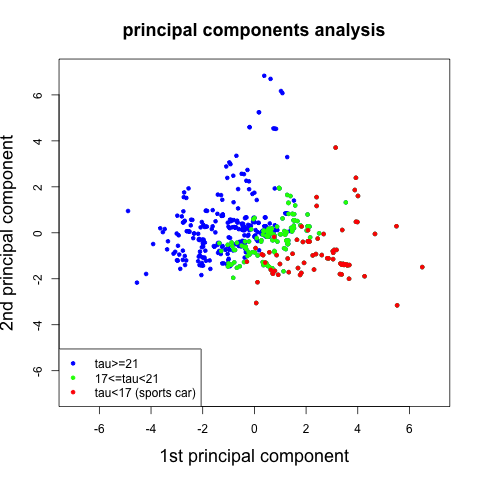
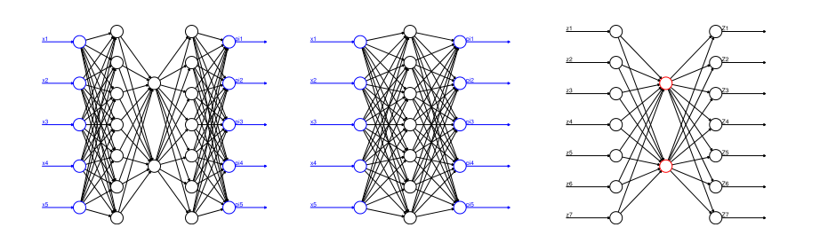
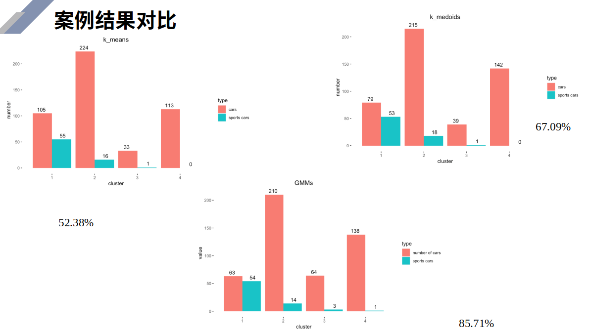

# 无监督学习方法 {#unsupervised-learning}

*梁译中、方明慧、王晗、高光远*

大学及以后生活中最常用的学习方法。

无监督学习方法目的是降低数据（协变量，特征）维度、把样本按照相似特征聚类并以图形方式说明高维数据的技术。无监督学习不考虑响应变量，仅考虑这些特征本身的相似性。

本章将考虑以下几种方法：

- **降维**：

  - 主成分分析（PCA）

  - 瓶颈神经网络（BNN）。

- **聚类**：

  - 分层聚类：不需事先指定聚类个数 （1）自下而上：初始n类，再将相距最近的两类合并，建立一个新的类，直到最后合并成一类；（2）自上而下：初始1类，再将相距最远的样本分裂成两类，直到最后分裂成n个类。

  - 基于质心的聚类: K-means, K-medoids

  - 基于分布的聚类: Gaussian mixture models(GMMs)

- **可视化高维数据**：

  - 变分自动编码器（VAE）
  
  - $t$分布随机邻近嵌入（$t$-SNE），
  
  - 统一流形逼近和投影（UMAP），
  
  - 自组织映射（SOM）
  
  - Kohonen图。

假设样本量为$n$的样本有$q$个特征$\mathbf{x}_1^*,\ldots,\mathbf{x}^*_n\in\mathbb{R}^q$。其设计矩阵为
$$\mathbf{X}^*=(\mathbf{x}_1^*,\ldots,\mathbf{x}^*_n)^\intercal\in\mathbb{R}^{n\times q}.$$
把设计矩阵的每列进行标准化，得到
$$\mathbf{X}=(x_{i,j})_{1\le i \le n,1\le j\le q}\in\mathbb{R}^{n\times q}.$$
其中，第$i$行是样本$i$的特征$\mathbf{x}_i\in\mathbb{R}^q, 1\le i\le n$, 第$j$列是第$j$个特征$x_j\in\mathbb{R}^n$.

## 数据预处理


|变量|类型|说明|
|:---:|:---:|---|
|brand|factor|43个汽车品牌|
|type|factor|96个水平|
|model|factor|113个水平|
|seats|int|座位数|
|max_power|int|发动机最大功率(kW),取对数|
|max_torque|num|最大转矩(Nm),取对数|
|cubic_capacity|int|容量(cm$^3$),取对数|
|weight|int|车重(kg)，取对数|
|max_engine_speed|int|发动机最大转速(rpm)|
|seconds_to_100|int|达到100km/h所需要秒数|
|top_speed|int|最大行驶速度(km/h)|
|sports_car|int|跑车|
|tau|num|专家评分|

$$\tau=\frac{\text{weight}}{\frac{\text{max_power}}{0.735499}}\text{seats}^{\frac{1}{3}}\left(\frac{\text{cubic_capacity}}{1000}\right)^{\frac{1}{4}}$$

专家把$\tau<17$的汽车定义为跑车。

<div class="figure" style="text-align: center">

<p class="caption">(\#fig:pairs)散点图</p>
</div>

## 主成分分析

简而言之，主成分分析的目的是降低高维数据的维数，使重构误差相对于原始数据最小。如果应用成功，它减少了特征空间的维数，并且它对于(精算)回归建模特别有用，因为它提供了少量的不相关的解释变量。

PCA适用于高斯分布，若变量显著不符合高斯分布，需要对数据进行预处理（比如取对数或其他方法）。

矩阵$\mathbf{X}$的秩为$q\le n$，可以找到$q$个正交的$q$维基向量$\mathbf{v}_1,\ldots,\mathbf{v}_q\in\mathbb{R}^q$, 使得$\mathbf{v}_1$为$\mathbf{X}$波动最大的方向，$\mathbf{v}_2$为与$\mathbf{v}_1$正交方向上的$\mathbf{X}$波动最大的方向，依次类推。

用数学公式表示如下：
$$\mathbf{v}_1=\underset{||\omega||_2=1}{\arg \max}||\mathbf{X}\omega||_2^2=\underset{\omega^\intercal\omega=1}{\arg \max} (\omega^\intercal\mathbf{X}^\intercal\mathbf{X}\omega)$$

$$\mathbf{v}_2=\underset{||\omega||_2=1}{\arg \max}||\mathbf{X}\omega||_2^2 ~~~\text{ subject to } \mathbf{v}_1^\intercal\omega=0.$$

$$\ldots$$

主成分分析可通过以下两种方式实现

- 求$\mathbf{X}^\intercal \mathbf{X}$或者$\mathbf{X}$的协方差矩阵$\mathbf{\Sigma}$的特征向量和特征值。易知$\mathbf{X}^\intercal \mathbf{X}=n\times\mathbf{\Sigma}$，所以它们的特征向量相同。第一个特征向量即为$\mathbf{v}_1$，第二个特征向量为$\mathbf{v}_2$。前两个主成分为$\mathbf{X}\mathbf{v}_1,\mathbf{X}\mathbf{v}_2$

- 对$\mathbf{X}$进行奇异值（singular value decomposition）分解:$$\mathbf{X}=U\Lambda V^\intercal.$$其中，对角矩阵$\Lambda=\text{diag}(\lambda_1,\ldots,\lambda_q)$的元素为$\mathbf{X}^\intercal \mathbf{X}$的特征值，$V$为$\mathbf{X}^\intercal \mathbf{X}$的特征向量。主成分可以通过$\mathbf{X}V$求得。

利用前$p$个主成分可以重构设计矩阵的近似值$$\mathbf{X}_p=U\text{diag}(\lambda_1,\ldots,\lambda_p,0,\ldots,0)V^{\intercal}.$$ 该近似值为以下极值问题的根$$\underset{B\in\mathbb{R}^{n\times q}}{\arg \min}||\mathbf{X}-B||^2 ~~\text{subject to rank}(B)\le q,$$ 即矩阵$\mathbf{X}_p$是所有秩为$p$的矩阵中，与原始设计矩阵$\mathbf{X}$重组平方误差(F范数)最小的矩阵。


```r
# standardize matrix
X <- X01/sqrt(colMeans(X01^2))[col(X01)]

# eigenvectors and eigenvalues
X1 <- as.matrix(X)
nrow(X1)
A <-  t(X1) %*% X1
A
sum(eigen(A)$value)/5
sqrt(eigen(A)$value)      # singular values
sqrt(eigen(A)$value/nrow(X1))   # scaled eigenvalues
eigen(A)$vector
A1<-cor(X1)
A1*nrow(X1)
sqrt(eigen(A1)$value)  
eigen(A1)$vector
eigen(A1)$value

# singular value decomposition
SVD <- svd(X1)
SVD$d                       # singular values
rbind(SVD$v[,1],SVD$v[,2])  # first two right singular vectors

# PCA with package PCA
t.pca <- princomp(X1,cor=TRUE)
t.pca$loadings          
summary(t.pca)
eigen(A1)$value/sum(eigen(A1)$value)

# PCA Sports Cars weights
alpha <- SVD$v[,1]/sds
(alpha_star <- c(alpha[1],alpha[2]-alpha[1], alpha[3], alpha[4], alpha[5]-alpha[2])/alpha[1])

# plot first two principal components
dat3 <- d.data 
dat3$v1 <- X1 %*% SVD$v[,1]
dat3$v2 <- X1 %*% SVD$v[,2]

# png("./plots/5/pca.png")
plot(x=dat3$v1, y=dat3$v2, col="blue",pch=20, ylim=c(-7,7), xlim=c(-7,7), ylab="2nd principal component", xlab="1st principal component", main=list("principal components analysis", cex=1.5), cex.lab=1.5)
dat0 <- dat3[which(dat3$tau<21),]
points(x=dat0$v1, y=dat0$v2, col="green",pch=20)
dat0 <- dat3[which(dat3$tau<17),]
points(x=dat0$v1, y=dat0$v2, col="red",pch=20)
legend("bottomleft", c("tau>=21", "17<=tau<21", "tau<17 (sports car)"), col=c("blue", "green", "red"), lty=c(-1,-1,-1), lwd=c(-1,-1,-1), pch=c(20,20,20))
#dev.off()

# reconstruction error
reconstruction.PCA <- array(NA, c(5))

for (p in 1:5){
  Xp <- SVD$v[,1:p] %*% t(SVD$v[,1:p]) %*% t(X)
  Xp <- t(Xp)
  reconstruction.PCA[p] <- sqrt(sum(as.matrix((X-Xp)^2))/nrow(X))
               }
round(reconstruction.PCA,2)               

# scatter plot
switch_sign <- -1           # switch sign of the first component to make svd and princomp compatible
tt.pca <- t.pca$scores
tt.pca[,1] <- switch_sign *tt.pca[,1]
pairs(tt.pca,diag.panel=panel.qq,upper.panel=panel.cor)

# biplot
tt.pca <- t.pca
tt.pca$scores[,1] <-  switch_sign * tt.pca$scores[,1]
tt.pca$loadings[1:5,1] <- switch_sign * tt.pca$loadings[1:5,1] 
biplot(tt.pca,choices=c(1,2),scale=0, expand=2, xlab="1st principal component", ylab="2nd principal component", cex=c(0.4,1.5), ylim=c(-7,7), xlim=c(-7,7))
```

<div class="figure" style="text-align: center">

<p class="caption">(\#fig:2pcas)主成分</p>
</div>

## 自编码

PCA对异常值很敏感，也有稳健的PCA版本。例如，Croux等人给出了一个基于中值绝对偏差(MADs)的算法，R包：pcaPP。
主成分分析可以看作是一个自动编码器。接下来，我们将更一般地介绍自动编码器，例如BNN。

自编码包含编码和解码两个镜面对称的映射：

- 编码: $\phi:\mathbb{R}^q\rightarrow\mathbb{R}^p$

- 解码: $\psi=\mathbb{R}^p\rightarrow\mathbb{R}^q$ 

作为非线性自编码器的一个例子，我们考虑瓶颈神经网络(BNN)。为了成功校准一个BNN，它的隐藏层数应该是奇数$d$ ($d$称为神经网络的深度)，并且中心隐藏层应该是低维的，有$p$个隐藏神经元，所有剩余的隐藏层应该是围绕这个中心隐藏层对称的。因此对于深度$d = 3$的BNN，我们可以选择图\@ref(fig:bnn-structure)展示的神经网络结构

<div class="figure" style="text-align: center">

<p class="caption">(\#fig:bnn-structure)自编码 q=5,p=2</p>
</div>


```r
bottleneck.1 <- function(q00, q22){
   Input <- layer_input(shape = c(q00), dtype = 'float32', name = 'Input')
   
   Output = Input %>% 
          layer_dense(units=q22, activation='tanh', use_bias=FALSE, name='Bottleneck') %>% 
          layer_dense(units=q00, activation='linear', use_bias=FALSE, name='Output')

   model <- keras_model(inputs = Input, outputs = Output)
   
   model %>% compile(optimizer = optimizer_nadam(), loss = 'mean_squared_error')
   model
   }

bottleneck.3 <- function(q00, q11, q22){   
   Input <- layer_input(shape = c(q00), dtype = 'float32', name = 'Input')
   
   Encoder = Input %>% 
          layer_dense(units=q11, activation='tanh', use_bias=FALSE, name='Layer1') %>%
          layer_dense(units=q22, activation='tanh', use_bias=FALSE, name='Bottleneck') 

   Decoder = Encoder %>% 
          layer_dense(units=q11, activation='tanh', use_bias=FALSE, name='Layer3') %>% 
          layer_dense(units=q00, activation='linear', use_bias=FALSE, name='Output')

   model <- keras_model(inputs = Input, outputs = Decoder)
   model %>% compile(optimizer = optimizer_nadam(), loss = 'mean_squared_error')
   model
   }
```


### 模型训练

图\@ref(fig:bnn-train)展示了自编码的训练过程。

<div class="figure" style="text-align: center">

<p class="caption">(\#fig:bnn-train)自编码训练过程</p>
</div>

具体过程如下：


```r
# bottleneck architecture
q1 <- 7
q2 <- 2
q0 <- ncol(X)

# pre-training 1: merging layers 1 and 3 (skipping bottleneck)
model.1 <- bottleneck.1(q0, q1)
model.1
epochs <- 2000
batch_size <- nrow(X)

# fit the merged model
{t1 <- proc.time()
  fit <- model.1 %>% fit(as.matrix(X), as.matrix(X), epochs=epochs, batch_size=batch_size, verbose=0)
proc.time()-t1}

plot(x=c(1:length(fit[[2]]$loss)), y=sqrt(fit[[2]]$loss*q0),  ylim=c(0,max(sqrt(fit[[2]]$loss*q0))),pch=19, cex=.5, xlab='epochs', ylab='Frobenius norm loss', main="gradient descent algorithm") 
abline(h=c(0.6124), col="orange")
 
# neuron activations in the central layer 
zz <- keras_model(inputs=model.1$input, outputs=get_layer(model.1, 'Bottleneck')$output)
yy <- zz %>% predict(as.matrix(X))

# pre-training 2: middlepart
model.2 <- bottleneck.1(q1, q2)
model.2
epochs <- 2000

# fit the merged model
{t1 <- proc.time()
  fit <- model.2 %>% fit(as.matrix(yy), as.matrix(yy), epochs=epochs, batch_size=batch_size, verbose=0)
proc.time()-t1}

plot(x=c(1:length(fit[[2]]$loss)), y=sqrt(fit[[2]]$loss*q0),  ylim=c(0,max(sqrt(fit[[2]]$loss*q0))),pch=19, cex=.5, xlab='epochs', ylab='Frobenius norm loss', main="gradient descent algorithm") 

# fitting the full model
model.3 <- bottleneck.3(q0, q1, q2)
model.3

# set weights
weight.3 <- get_weights(model.3)
weight.1 <- get_weights(model.1)
weight.2 <- get_weights(model.2)
weight.3[[1]] <- weight.1[[1]]
weight.3[[4]] <- weight.1[[2]]
weight.3[[2]] <- weight.2[[1]]
weight.3[[3]] <- weight.2[[2]]
set_weights(model.3, weight.3)
fit0 <- model.3 %>% predict(as.matrix(X))

# reconstruction error of the pre-calibrated network
# note that this error may differ from the tutorial because we did not set a seed
round(Frobenius.loss(X,fit0),4)

# calibrate full bottleneck network
epochs <- 10000
batch_size <- nrow(X)
{t1 <- proc.time()
  fit <- model.3 %>% fit(as.matrix(X), as.matrix(X), epochs=epochs, batch_size=batch_size, verbose=0)
proc.time()-t1}

plot(x=c(1:length(fit[[2]]$loss)), y=sqrt(fit[[2]]$loss*q0), col="blue", ylim=c(0,max(sqrt(fit[[2]]$loss*q0))),pch=19, cex=.5, xlab='epochs', ylab='Frobenius norm loss', main=list("gradient descent algorithm", cex=1.5), cex.lab=1.5) 
abline(h=c(0.6124), col="orange", lwd=2) 
legend("bottomleft", c("decrease GDM", "PCA(p=2)"), col=c("blue", "orange"), lty=c(-1,1), lwd=c(-1,2), pch=c(19,-1))

# reconstruction error (slightly differs from 0.5611 because of missing seed)
fit0 <- model.3 %>% predict(as.matrix(X))
round(Frobenius.loss(X,fit0),4)

# read off the bottleneck activations
encoder <- keras_model(inputs=model.3$input, outputs=get_layer(model.3, 'Bottleneck')$output)
y<- predict(encoder,as.matrix(X))
y0 <- max(abs(y))*1.1

# note that we may need sign switches to make it comparable to PCA
plot(x=y[,1], y=y[,2], col="blue",pch=20, ylim=c(-y0,y0), xlim=c(-y0,y0), ylab="2nd bottleneck neuron", xlab="1st bottleneck neuron", main=list("bottleneck neural network autoencoder", cex=1.5), cex.lab=1.5)
dat0 <- y[which(d.data$tau<21),]
points(x=dat0[,1], y=dat0[,2], col="green",pch=20)
dat0 <- y[which(d.data$tau<17),]
points(x=dat0[,1], y=dat0[,2], col="red",pch=20)
legend("bottomright", c("tau>=21", "17<=tau<21", "tau<17 (sports car)"), col=c("blue", "green", "red"), lty=c(-1,-1,-1), lwd=c(-1,-1,-1), pch=c(20,20,20))
```

## K-means clustering

K-means聚类是一种基于质心（centroid-based）的聚类方法，它将$n$个样本点$\mathbf{x}_i\in\mathcal{X}\subset\mathbb{R}^q$划分为$K$个不相交的类:$$\mathcal{C}_K:\mathbb{R}^q\rightarrow\mathcal{K}=\{1,\ldots,K\},~~\mathbf{x}\mapsto\mathcal{C}_K(\mathbf{x})$$，以上给出了对特征空间$\mathcal{X}$的一个分割$(C_1,\ldots,C_K)$，其中$$C_k=\{\mathbf{x}\in\mathcal{X};\mathcal{C}_K(\mathbf{x})=k\}$$

确定$\mathcal{C}_K$的原则是使总类内差异最小，这可以转化为计算使类内离差平方和总和最小的一个分割，所构造的目标函数为 ：
$$\underset{(C_1,\ldots,C_K)}{\arg \min}\sum_{k=1}^K\sum_{\mathbf{x}_i\in C_k\cap\mathcal{X}}d(\mathbf{\mu}_k,\mathbf{x}_i)=\underset{(C_1,\ldots,C_K)}{\arg \min}\sum_{k=1}^K\sum_{\mathbf{x}_i\in C_k\cap\mathcal{X}}||\mathbf{\mu}_k,\mathbf{x}_i||_2^2$$

其中$\mathbf{\mu}_k$为类均值向量，因此目标函数衡量了类内样本点围绕类均值向量的紧密程度，其值越小意味着类内样本相似度越高，聚类效果越好。但是上述目标函数并不容易找到最优解，这需要考虑$n$个样本点所有可能的类划分，因此K-means算法采用了贪心策略，通过迭代优化来近似求解上述目标函数。


```r
# initialize
Kaverage <- colMeans(X)
K0 <- 10
TWCD <- array(NA, c(K0))  # total within-cluster dissimilarity
Classifier <- array(1, c(K0, nrow(X)))
(TWCD[1] <- sum(colSums(as.matrix(X^2))))

# run K-means algorithm
set.seed(100)
for (K in 2:K0){ 
   if (K==2){(K_res <- kmeans(X,K) )}
   if (K>2){(K_res  <- kmeans(X,K_centers) )}
   TWCD[K] <- sum(K_res$withins)
   Classifier[K,] <- K_res$cluster
   K_centers <- array(NA, c(K+1, ncol(X)))
   K_centers[K+1,] <- Kaverage
   K_centers[1:K,] <- K_res$centers 
                }

# plot losses                
xtitle <- "decrease in total within-cluster dissimilarity "
plot(x=c(1:K0), y=TWCD, ylim=c(0, max(TWCD)), main=list(xtitle, cex=1.5), col="blue", cex=1.5, pch=20, ylab="total within-cluster dissimilarity", xlab="hyperparameter K", cex.lab=1.5)
lines(x=c(1:K0), y=TWCD, col="blue", lty=3)

# singular value decomposition
SVD <- svd(as.matrix(X))
pca <- c(1,2)
dat3 <- d.data
dat3$v1 <- as.matrix(X) %*% SVD$v[,pca[1]]
dat3$v2 <- as.matrix(X) %*% SVD$v[,pca[2]]

lim0 <- 7

plot(x=dat3$v1, y=dat3$v2, col="orange",pch=20, ylim=c(-lim0,lim0), xlim=c(-lim0,lim0), ylab=paste("principal component ", pca[2], sep=""),xlab=paste("principal component ", pca[1], sep=""),, main=list("K-means vs. PCA", cex=1.5), cex.lab=1.5)
dat0 <- dat3[which(Classifier[4,]==4),]
points(x=dat0$v1, y=dat0$v2, col="blue",pch=20)
dat0 <- dat3[which(Classifier[4,]==1),]
points(x=dat0$v1, y=dat0$v2, col="red",pch=20)
dat0 <- dat3[which(Classifier[4,]==3),]
points(x=dat0$v1, y=dat0$v2, col="magenta",pch=20)
legend("bottomleft", c("cluster 1", "cluster 2", "cluster 3", "cluster 4"), col=c("red", "orange", "magenta", "blue"), lty=c(-1,-1,-1,-1), lwd=c(-1,-1,-1,-1), pch=c(20,20,20,20))
```


## K-medoids clustering (PAM)


```r
set.seed(100)
(K_res <- pam(X, k=4, metric="manhattan", diss=FALSE))

# plot K-medoids versus PCA
plot(x=dat3$v1, y=dat3$v2, col="orange",pch=20, ylim=c(-lim0,lim0), xlim=c(-lim0,lim0), ylab=paste("principal component ", pca[2], sep=""),xlab=paste("principal component ", pca[1], sep=""),, main=list("K-medoids vs. PCA", cex=1.5), cex.lab=1.5)
dat0 <- dat3[which(K_res$cluster==4),]
points(x=dat0$v1, y=dat0$v2, col="red",pch=20)
dat0 <- dat3[which(K_res$cluster==3),]
points(x=dat0$v1, y=dat0$v2, col="blue",pch=20)
dat0 <- dat3[which(K_res$cluster==2),]
points(x=dat0$v1, y=dat0$v2, col="magenta",pch=20)
points(x=dat3[K_res$id.med,"v1"],y=dat3[K_res$id.med,"v2"], col="black",pch=20, cex=2)
legend("bottomleft", c("cluster 1", "cluster 2", "cluster 3", "cluster 4"), col=c("red", "orange", "magenta", "blue"), lty=c(-1,-1,-1,-1), lwd=c(-1,-1,-1,-1), pch=c(20,20,20,20))
```

## Gaussian mixture models(GMMs)


```r
seed <- 100
set.seed(seed)
K_res <- GMM(X, gaussian_comps=4, dist_mode="eucl_dist", seed_mode="random_subset", em_iter=5, seed=seed)
summary(K_res)
clust <- predict_GMM(X, K_res$centroids, K_res$covariance_matrices, K_res$weights)$cluster_labels

pred <- predict_GMM(X, K_res$centroids, K_res$covariance_matrices, K_res$weights)
names(pred)

pred$cluster_labels[1:5]
pred$cluster_proba[1:5,]

K_res$centroids

# singular value decomposition
SVD <- svd(as.matrix(X))

pca <- c(1,2)
dat3 <- d.data
dat3$v1 <- as.matrix(X) %*% SVD$v[,pca[1]]
dat3$v2 <- as.matrix(X) %*% SVD$v[,pca[2]]

(kk1 <- K_res$centroids %*% SVD$v[,pca[1]])
(kk2 <- K_res$centroids %*% SVD$v[,pca[2]])

lim0 <- 7

plot(x=dat3$v1, y=dat3$v2, col="orange",pch=20, ylim=c(-lim0,lim0), xlim=c(-lim0,lim0), ylab=paste("principal component ", pca[2], sep=""),xlab=paste("principal component ", pca[1], sep=""),, main=list("GMM(diagonal) vs. PCA", cex=1.5), cex.lab=1.5)
dat0 <- dat3[which(clust==0),]
points(x=dat0$v1, y=dat0$v2, col="red",pch=20)
dat0 <- dat3[which(clust==3),]
points(x=dat0$v1, y=dat0$v2, col="blue",pch=20)
dat0 <- dat3[which(clust==1),]
points(x=dat0$v1, y=dat0$v2, col="magenta",pch=20)
points(x=kk1,y=kk2, col="black",pch=20, cex=2)
legend("bottomleft", c("cluster 1", "cluster 2", "cluster 3", "cluster 4"), col=c("red", "orange", "magenta", "blue"), lty=c(-1,-1,-1,-1), lwd=c(-1,-1,-1,-1), pch=c(20,20,20,20))
```

图\@ref(fig:cluster-results)展示了聚类的结果，GMMs最好。

<div class="figure" style="text-align: center">

<p class="caption">(\#fig:cluster-results)聚类比较</p>
</div>


## t-SNE

t分布-随机邻近嵌入(t-SNE, t-distributed stochastic neighbor embedding)由 Laurens van der Maaten和Geoffrey Hinton在2008年提出。t-SNE本质是一种嵌入模型，能够将高维空间中的数据映射到低维空间中，并保留数据集的局部特性。

基本原理
t-SNE将数据点之间的相似度转化为条件概率，原始空间中数据点的相似度由高斯联合分布表示，嵌入空间中数据点的相似度由t分布表示。
将原始空间和嵌入空间的联合概率分布的KL散度作为损失函数(loss function)，评估嵌入效果的好坏。通过梯度下降算法最小化损失函数，最终获得收敛结果。


```r
require(MASS)
library(plyr)
library(stringr)
library(plotrix)
library(matrixStats)
library(tsne)
library(umap)
library(kohonen)
seed <- 100
set.seed(seed)
# it takes roughly 50 seconds
# KL divergence 0.427991566501587
{t1 <- proc.time()
   (K_res <- tsne(X, k=2, initial_dim=ncol(X), perplexity=30))
proc.time()-t1}

i1 <- 2
i2 <- 1
sign0 <- 1

K_res1 <- K_res[,c(i1,i2)]
K_res1 <- sign0 * K_res1
plot(K_res1, pch=20, col="blue", cex.lab=1.5, ylab=paste("component ", i2, paste=""), xlab=paste("component ", i1, paste=""), main=list(paste("t-SNE with seed ", seed, sep=""), cex=1.5))
dat0 <- K_res1[which(d.data$tau<21),]
points(dat0, col="green",pch=20)
dat0 <- K_res1[which(d.data$tau<17),]
points(dat0, col="red",pch=20)
legend("bottomleft", c("tau>=21", "17<=tau<21", "tau<17 (sports car)"), col=c("blue", "green", "red"), lty=c(-1,-1,-1), lwd=c(-1,-1,-1), pch=c(20,20,20))
```


## UMAP

统一流形逼近与投影(UMAP, Uniform Manifold Approximation and Projection)是建立在黎曼几何和代数拓扑理论框架上的新的降维流形学习技术。在可视化质量方面，UMAP算法与t-SNE具有竞争优势，但是它保留了更多全局结构、具有优越的运行性能、更好的可扩展性。

基本原理

1. 计算高维的流形结构特征，确定高维空间中各个点之间的距离，从而构造高维的数据分布结构。

2. 将它们投影到低维空间，根据高维空间点与点之间的相对关系，提取特征值，在低维空间中重构这种距离关系，并计算低维空间中各个点之间的距离。

3. 使用随机梯度下降来最小化这些距离之间的差异。


```r
kNeighbors <- 15     # default is 15
seed <- 100
set.seed(seed)
min_dist <- .1

umap.param <- umap.defaults
umap.param$n_components <- 2
umap.param$n_neighbors <- kNeighbors  
umap.param$random_state <- seed 
umap.param$min_dist <- min_dist 

{t1 <- proc.time()
   (K_res <- umap(X, config=umap.param, method="naive"))
proc.time()-t1}

i1 <- 2
i2 <- 1
sign0 <- 1

K_res1 <- K_res$layout[,c(i1,i2)]
K_res1 <- sign0 * K_res1
plot(K_res1, pch=20, col="blue", cex.lab=1.5, ylab=paste("component ", i2, paste=""), xlab=paste("component ", i1, paste=""), main=list(paste("UMAP (k=", kNeighbors, " NN and min_dist=", min_dist,")", sep=""), cex=1.5))
dat0 <- K_res1[which(d.data$tau<21),]
points(dat0, col="green",pch=20)
dat0 <- K_res1[which(d.data$tau<17),]
points(dat0, col="red",pch=20)
legend("bottomright", c("tau>=21", "17<=tau<21", "tau<17 (sports car)"), col=c("blue", "green", "red"), lty=c(-1,-1,-1), lwd=c(-1,-1,-1), pch=c(20,20,20))
```

## SOM

自组织映射(Self-organizing map, SOM)是一种竞争型神经网络，由输入层和竞争层（常见2维）构成。

- **输入层**神经元的数量由输入向量的维度决定，一个神经元对应一个特征

- **竞争层**的常见结构：矩形(Rectangular)、六边形(Hexagonal) 竞争层神经元的数量决定了最终模型的粒度与规模，对最终模型的准确性与泛化能力影响很大。

- **基本原理**：运用竞争学习(competitive learning)策略，竞争层各神经元竞争对输入层响应的机会，最后仅有一个神经元获胜，代表对输入层的分类。如此迭代，逐步优化网络。

图\@ref(fig:som-ill)展示了SOM的结构。

<div class="figure" style="text-align: center">

<p class="caption">(\#fig:som-ill)SOM</p>
</div>


```r
n1 <- 2
n2 <- 10

set.seed(100)
{t1 <- proc.time()
 som.X <- som(as.matrix(X), grid = somgrid(xdim=n1, ydim=n2, topo="rectangular"), 
                            rlen= 100, dist.fcts="sumofsquares")
proc.time()-t1}


summary(som.X)

plot(som.X,c("changes"), main=list("training progress", cex=1.5), col="blue", cex.lab=1.5)            # training progress

plot(som.X,c("counts"), main="allocation counts to neurons", cex.lab=1.5)

d.data$tau2 <- d.data$sports_car+as.integer(d.data$tau<21)+1
plot(som.X,c("mapping"), classif=predict(som.X), col=c("blue","green","red")[d.data$tau2], pch=19, main="allocation of cases to neurons")
```


