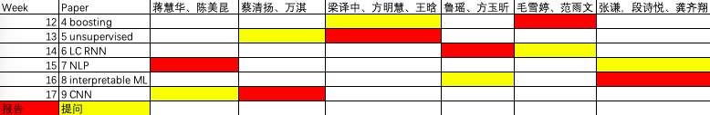

--- 
title: "现代精算统计模型"
author: "Modern Actuarial Models"
date: "2020-11-22 18:00:14"
site: bookdown::bookdown_site
output: bookdown::gitbook
documentclass: book
bibliography: [_reference.bib]
biblio-style: apalike
link-citations: yes
github-repo: sxpyggy/Modern-Actuarial-Models
description: "The output format is bookdown::gitbook."
editor_options: 
  chunk_output_type: console
---

# 👨‍🏫 欢迎  {-}

《现代精算统计模型》主要讲述如何使用统计学习和机器学习算法，提升传统的精算统计模型或者解决新的精算问题。这门课主要参考瑞士精算师协会发布的[“精算数据科学”](https://actuarialdatascience.org)，该教程的主要目的是“为精算师提供一个对数据科学全面且易懂的介绍”，该教程提供了多篇方法性文章并开源代码，这样“读者可以相对容易地把这些数据科学方法用在自己的数据上”。

我们建议大家仔细阅读以下文献，尝试并理解[所有代码](https://github.com/JSchelldorfer/ActuarialDataScience)。此网站将作为该课程的辅助，为大家答疑，总结文献，并对文献中的方法做扩展。该网站由授课老师高光远和助教张玮钰管理，欢迎大家反馈意见到助教、微信群、或邮箱 <guangyuan.gao@ruc.edu.cn>。

## 🤔 答疑{-}

我定期把同学们的普遍疑问在这里解答，欢迎提问！

**👉 随机种子数**(2020/11/20)

输入`RNGversion("3.5.0"); set.seed(100)`，使得你的随机种子数和paper的相同，模型结果相近。

**👉 MAC OS, Linux, WIN** (2020/11/16)

据观察，在MAC OS和Linux系统下安装`keras`成功的比例较高。WIN系统下，Python各个包的依赖以及和R包的匹配有一定的问题，今天是通过更换镜像源解决了R中无法加载`tensorflow.keras`模块的问题，推测是TUNA源中WIN包依赖关系没有及时更新。

为了解决镜像源更新延迟、或者tensorflow版本过低的问题，这里共享WIN下经测试的[conda环境](https://www.jianguoyun.com/p/DcwPgUgQ3cTHBhi1-s0D)配置。下载该文档，从该文档所在文件夹启动命令行，使用命令`conda env create --name <env> --file filename.yaml`，安装该conda环境。在R中使用`reticulate::use_condaenv("<env>",required=T)`关联该环境。

另外，可下载MAC OS系统下经测试的[conda环境](https://www.jianguoyun.com/p/DYethK4Q3cTHBhjr4s0D)配置。可通过`conda env create --name <env> --file filename.yaml`安装。

**👉  CASdatasets** (2020/11/13)

源文件在<http://cas.uqam.ca/>，但下载速度很慢，我把它放在[坚果云共享](https://www.jianguoyun.com/p/DdFyh74Q3cTHBhio2M0D)。下载后选择install from local archive file。

**👉  微信群** (2020/11/08)

## 🗓️ 课程安排 {-}

以下安排为初步计划，根据大家的需求和背景，我们可能要花更多的时间在某些重要的方法及其在精算上的应用。

- 第10周：

  准备工作。

- 第11周: 
  
  1 - French Motor Third-Party Liability Claims 
    
  <https://papers.ssrn.com/sol3/papers.cfm?abstract_id=3164764>

- 机动

  2 - Inisghts from Inside Neural Networks
    
  <https://papers.ssrn.com/sol3/papers.cfm?abstract_id=3226852>

  3 - Nesting Classical Actuarial Models into Neural Networks
  
  <https://papers.ssrn.com/sol3/papers.cfm?abstract_id=3320525>

- 第12周：

  4 - On Boosting: Theory and Applications
    
    <https://papers.ssrn.com/sol3/papers.cfm?abstract_id=3402687>
  
- 第13周：

  5 - Unsupervised Learning: What is a Sports Car
  
  <https://papers.ssrn.com/sol3/papers.cfm?abstract_id=3439358>
  
- 第14周：

  6 - Lee and Carter go Machine Learning: Recurrent Neural Networks
  
  <https://papers.ssrn.com/sol3/papers.cfm?abstract_id=3441030>

- 第15周：

  7 - The Art of Natural Language Processing: Classical, Modern and Contemporary Approaches to Text Document Classification
  
  <https://papers.ssrn.com/sol3/papers.cfm?abstract_id=3547887>

- 第16周：

  8 - Peeking into the Black Box: An Actuarial Case Study for Interpretable Machine Learning 
  
  <https://papers.ssrn.com/sol3/papers.cfm?abstract_id=3595944>

- 第17周：

  9 - Convolutional neural network case studies: (1) Anomalies in Mortality Rates (2) Image Recognition 
  
  <https://papers.ssrn.com/sol3/papers.cfm?abstract_id=3656210>

